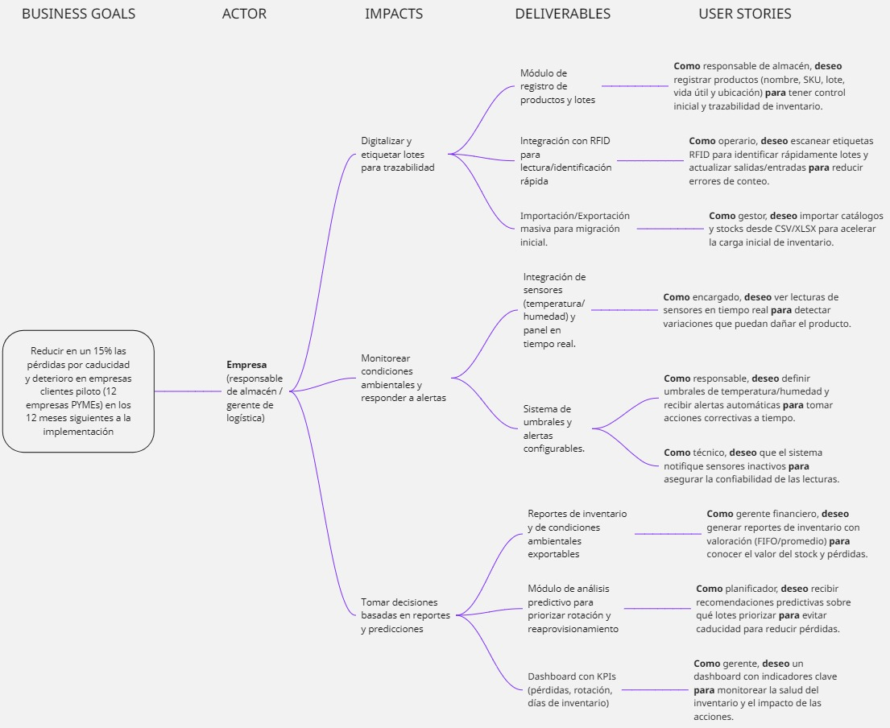
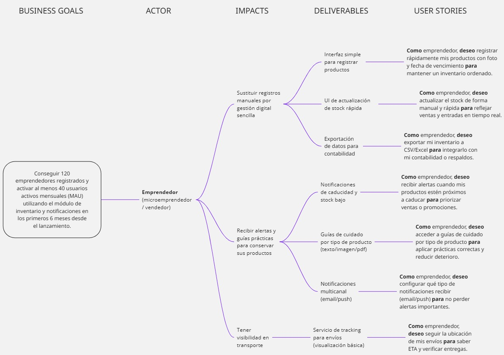

<p align="center">
    </img><br>
    <strong>Universidad Peruana de Ciencias Aplicadas</strong><br>
    <strong>Ingeniería de Software - 2025-20</strong><br>
    <strong>Desarrollo de Aplicaciones Open Source - 1ASI0729</strong><br>
    <strong>NRC: 7237</strong><br>
    <strong>Profesor: Angel Augusto Velasquez Nuñez</strong><br>
    <br><strong>"Informe del Trabajo Final"</strong><br>
    <br>
    <strong>Startup: The Null Team</strong><br>
    <strong>Nombre del Producto: Storigent</strong><br>
</p>

<div style="display: flex; flex-direction: column; align-items: center; text-align: center;">
    <h3>Team Members:</h3>
    <table style="margin: auto; border-collapse: collapse;">
        <tr>
            <th style="text-align: center; padding: 8px;">Member</th>
            <th style="text-align: center; padding: 8px;">Code</th>
        </tr>
        <tr>
            <td style="padding: 8px;">Calixto Iriarte, David Alejandro</td>
            <td style="padding: 8px;">U20201b441</td>
        </tr>
        <tr>
            <td style="padding: 8px;">Cespedes Pillco, Jarod Jack</td>
            <td style="padding: 8px;">U202318588</td>
        </tr>
        <tr>
            <td style="padding: 8px;">Espinar Martínez, Gabriel Ferran</td>
            <td style="padding: 8px;">U202310436</td>
        </tr>
        <tr>
            <td style="padding: 8px;">Tello Murga, Javier Oswaldo</td>
            <td style="padding: 8px;">u202218387</td>
        </tr>
        <tr>
            <td style="padding: 8px;">Zagaceta Bardales, Rodrigo Enrique</td>
            <td style="padding: 8px;">U202215489</td>
        </tr>
                <tr>
            <td style="padding: 8px;">Meza Tataje, David</td>
            <td style="padding: 8px;">U202516291</td>
        </tr>
    </table>
</div>

<p align="center">
    <strong>Septiembre, 2025</strong>
</p>
<br>

# Registro de versiones del Informe
<table>
    <thead>
        <tr>
            <th>Versión</th>
            <th>Fecha</th>
            <th>Autor</th>
            <th>Descripción de modificaciones</th>
        </tr>
    </thead>
    <tbody>
        <tr>
            <th>v0.1</th>
            <td>2025-09-02</td>
            <td>Tello Murga, Javier Oswaldo</td>
            <td>Se añadió Epic ID y User Stories.</td>
        </tr>
        <tr>
            <th>v0.2</th>
            <td>2025-09-04</td>
            <td>Zagaceta Bardales, Rodrigo Enrique</td>
            <td>Se añadió contenido sobre diseño de entrevistas.</td>
        </tr>
        <tr>
            <th>v0.3</th>
            <td>2025-09-04</td>
            <td>Zagaceta Bardales, Rodrigo Enrique</td>
            <td>Se añadió análisis del panorama competitivo y competidores.</td>
        </tr>
        <tr>
            <th>v0.4</th>
            <td>2025-09-04</td>
            <td>Zagaceta Bardales, Rodrigo Enrique</td>
            <td>Se añadieron estrategias y tácticas frente a competidores.</td>
        </tr>
        <tr>
            <th>v0.5</th>
            <td>2025-09-13</td>
            <td>Calixto Iriarte, David Alejandro</td>
            <td>Se realizaron actualizaciones en el archivo README.md con contenido documental relevante.</td>
        </tr>
        <tr>
            <th>v0.6</th>
            <td>2025-09-15</td>
            <td>Zagaceta Bardales, Rodrigo Enrique</td>
            <td>Se añadió contenido del registro de entrevistas.</td>
        </tr>
        <tr>
            <th>v0.7</th>
            <td>2025-09-15</td>
            <td>Zagaceta Bardales, Rodrigo Enrique</td>
            <td>Se añadió más contenido al registro de entrevistas.</td>
        </tr>
        <tr>
            <th>v0.8</th>
            <td>2025-09-15</td>
            <td>Tello Murga, Javier Oswaldo</td>
            <td>Se añadieron nuevas User Stories (37–42), Epic ID O7 e Impact Mapping.</td>
        </tr>
        <tr>
            <th>v0.9</th>
            <td>2025-09-15</td>
            <td>Céspedes Pillco, Jarod Jack</td>
            <td>Se añadió plantilla de planificación del sprint, backlog, líderes y colaboradores, y evidencias de desarrollo, ejecución, servicios y despliegue para la revisión del sprint.</td>
        </tr>
        <tr>
            <th>v0.10</th>
            <td>2025-09-15</td>
            <td>Céspedes Pillco, Jarod Jack</td>
            <td>Se añadió sección de colaboración del equipo durante el sprint.</td>
        </tr>
        <tr>
            <th>v0.11</th>
            <td>2025-09-17</td>
            <td>Tello Murga, Javier Oswaldo</td>
            <td>Se añadió el product backlog y su URL de referencia.</td>
        </tr>
        <tr>
            <th>v0.12</th>
            <td>2025-09-17</td>
            <td>Espinar Martínez, Gabriel Ferran</td>
            <td>Se añadió contenido sobre arquitectura de software, arquitectura de información y diseño de nivel de eventos.</td>
        </tr>
        <tr>
            <th>v0.13</th>
            <td>2025-09-18</td>
            <td>Zagaceta Bardales, Rodrigo Enrique</td>
            <td>Se añadió contenido del registro de entrevistas.</td>
        </tr>
        <tr>
            <th>v0.14</th>
            <td>2025-09-18</td>
            <td>Zagaceta Bardales, Rodrigo Enrique</td>
            <td>Se añadió contenido del análisis de entrevistas.</td>
        </tr>
        <tr>
            <th>v0.15</th>
            <td>2025-09-18</td>
            <td>Zagaceta Bardales, Rodrigo Enrique</td>
            <td>Se añadió contenido del user persona.</td>
        </tr>
        <tr>
            <th>v0.16</th>
            <td>2025-09-18</td>
            <td>Zagaceta Bardales, Rodrigo Enrique</td>
            <td>Se añadió matriz de tareas del usuario.</td>
        </tr>
        <tr>
            <th>v0.17</th>
            <td>2025-09-18</td>
            <td>Zagaceta Bardales, Rodrigo Enrique</td>
            <td>Se añadió contenido de anexos.</td>
        </tr>
        <tr>
            <th>v0.18</th>
            <td>2025-09-18</td>
            <td>Zagaceta Bardales, Rodrigo Enrique</td>
            <td>Se añadieron líneas de tiempo, duración y enlaces de video por entrevista.</td>
        </tr>
        <tr>
            <th>v0.19</th>
            <td>2025-09-18</td>
            <td>Meza Tataje, David</td>
            <td>Se añadió contenido explicativo sobre User Journey Mapping, Empathy Mapping, Big Picture EventStorming y Lenguaje Ubicuo.</td>
        </tr>
        <tr>
            <th>v0.20</th>
            <td>2025-09-18</td>
            <td>Espinar Martínez, Gabriel Ferran</td>
            <td>Se añadieron lineamientos de estilo web, imágenes de estilo general y mockups de la landing page.</td>
        </tr>
        <tr>
            <th>v0.21</th>
            <td>2025-09-18</td>
            <td>Céspedes Pillco, Jarod Jack</td>
            <td>Se añadió contenido del sprint backlog, guía de estilo de código fuente, gestión de código, configuración del entorno de desarrollo y asignación de roles en la tabla de líderes de aspectos.</td>
        </tr>
        <tr>
            <th>v0.22</th>
            <td>2025-09-18</td>
            <td>Céspedes Pillco, Jarod Jack</td>
            <td>Se añadieron actividades en la tabla de colaboración del equipo.</td>
        </tr>
        <tr>
            <th>v0.23</th>
            <td>2025-09-18</td>
            <td>Calixto Iriarte, David Alejandro</td>
            <td>Se añadieron correcciones y complementos al archivo README.md.</td>
        </tr>
        <tr>
            <th>v0.24</th>
            <td>2025-09-18</td>
            <td>Zagaceta Bardales, Rodrigo Enrique</td>
            <td>Se añadió contenido de conclusiones, bibliografía y anexos.</td>
        </tr>
        <tr>
            <th>v0.25</th>
            <td>2025-09-18</td>
            <td>Zagaceta Bardales, Rodrigo Enrique</td>
            <td>Se añadió tabla de resultados de aprendizaje estudiantil.</td>
        </tr>
        <tr>
            <th>v0.26</th>
            <td>2025-09-18</td>
            <td>Zagaceta Bardales, Rodrigo Enrique</td>
            <td>Se añadió contenido sobre colaboración en el capítulo 2.</td>
        </tr>
    </tbody>
</table>

<br><br>
# Project Report Collaboration Insights

Enlace al repositorio de GitHub TB1: [Repositorio GitHub TB1](https://github.com/The-null-team/the-null-team-storigent-report/tree/develop?tab=readme-ov-file)

Colaboración en el desarrollo del informe del proyecto Storigent:

Calixto Iriarte, David Alejandro:


Céspedes Pillco, Jarod Jack:


Espinar Martínez, Gabriel Ferran:


Tello Murga, Javier Oswaldo:


Zagaceta Bardales, Rodrigo Enrique:


Meza Tataje, David:


Todos los integrantes:


<br><br>

# Student Outcome

<table>
         <tr>
                <td>Criterio específico</td>
                <td>Acciones realizadas</td>
                <td>Conclusiones</td>
        </tr>
        <tr>
                <td>Comunica oralmente con efectividad a diferentes rangos de audiencia.</td>
                <td>TB1 
                <br><br>Calixto Iriarte, David Alejandro: Para esta entrega realice entrevistas de las cuales obtuvimos informacion acerca de las necesidades, objetivos y frustraciones de nuestros segmentos objetivos como empresarios/emprendedores. Ademas, ayude con el desarrollo del Software Architecture Diagrams y Database Diagram.
                <br><br>Cespedes Pillco, Jarod Jack: Realicé presentaciones de los avances del proyecto a mis compañeros de equipo, traté de explicar temas técnicos con un lenguaje sencillo, utilicé recursos de apoyo para mejorar la comprensión y practiqué previamente para mejorar mi seguridad y fluidez al hablar.
                <br><br>Espinar Martínez, Gabriel Ferran: Participé en la exposición oral explicando los apartados de Style Guidelines, Information Architecture, Landing Page UI Design y Domain-Driven Software Architecture.
                <br><br>Tello Murga, Javier Oswaldo: Expliqué a mi equipo el trabajo que realicé con las User Stories, sus Epic ID, el Impact Mapping y el Product Backlog. Comenté cómo cada historia se relaciona con las metas del proyecto y respondí las dudas que surgieron. Hablé en un lenguaje simple para que todos pudieran entender, incluso quienes no estaban familiarizados con los términos técnicos, y me aseguré de que cada idea quedara clara.
                <br><br>Zagaceta Bardales, Rodrigo Enrique: Realicé el contenido correspondiente desde el punto 2.1 hasta el 2.5, abarcando el proceso de competidores, entrevistas y needfinding.
                <br><br>Meza Tataje, David: Presenté los avances del proyecto relacionados con el Empathy Mapping, User Journey Mapping, Big Picture EventStorming y Ubiquitous Language a mis compañeros de equipo. Expliqué conceptos técnicos y diagramas complejos utilizando un lenguaje sencillo y ejemplos prácticos, apoyándome en imágenes y material visual para facilitar la comprensión. Practiqué previamente mis explicaciones para mejorar la seguridad y fluidez al hablar, y adapté mi discurso según el conocimiento previo de la audiencia.
                </td>
                <td>TB1 
                <br><br>Calixto Iriarte, David Alejandro: Pude entender el enfoque que tenemos llevar como grupo al momento de desarrollar nuestro proyecto de trabajo final, aun veo que queda cosas que implementar cuando avancemos con los hitos de entregas.
                <br><br>Cespedes Pillco, Jarod Jack: En esta entrega, mejoré en adaptar mi forma de hablar según el tipo de audiencia, mejoré mi confianza para expresarme en público, me dí cuenta que el uso de ejemplos y material visual facilita la compresión de ideas complejas. Reconozco que es importante organizar bien el discurso para poder transmitir mensajes claros y efectivos.
                <br><br>Espinar Martínez, Gabriel Ferran: Considero que esta presentación me permitió mejorar mi capacidad de comunicación oral, ya que tuve que explicar conceptos técnicos de forma sencilla y estructurada. Esto fue clave para asegurar que los diagramas y diseños fueran comprendidos por diferentes audiencias.
                <br><br>Tello Murga, Javier Oswaldo: Me sentí más seguro al hablar frente a mis compañeros y pude expresar las ideas de forma ordenada. Aprendí que adaptarse al tipo de público es importante para que todos comprendan. También noté que dar ejemplos concretos ayuda a que la explicación sea más fácil de seguir.
                <br><br>Zagaceta Bardales, Rodrigo Enrique: En la presente entrega, pude mejorar mi comunicación oral con los integrants del grupo para tener un mayor entendimiento y coordinación en las tareas asignadas, además de practicar la exposición de ideas y conceptos técnicos de manera clara y concisa.
                <br><br>Meza Tataje, David: Esta experiencia reforzó mi capacidad para comunicar ideas complejas de manera clara y comprensible a diferentes tipos de audiencia. Aprendí que el uso de recursos visuales, ejemplos concretos y una estructura clara mejora la retención de información y facilita la comprensión de procesos técnicos, contribuyendo a presentaciones más efectivas y profesionales.
                </td>
        </tr>
        <tr>
                <td>Comunica por escrito con efectividad a diferentes rangos de audiencia.</td>
                <td>TB1 
                <br><br>Calixto Iriarte, David Alejandro: Con la ayuda de mi grupo establecimos objetivos a realizar para esta entrega, tomando en cuenta la prioridad de cada punto a desarrollar. Se tuvo que usar herramientas especificas cada capitulo del proyecto. 
                <br><br>Cespedes Pillco, Jarod Jack: Escribí el informe con un lenguaje formal y estructurado, hice resúmenes claros para que mis compañeros entendieran los puntos clave del trabajo, utilicé tablas, diagramas listas para organizar la información escrita de forma más comprensible, revisé y corregí mis redacciones para evitar errores.
                <br><br>Espinar Martínez, Gabriel Ferran: Redacté los apartados 4.1 Style Guidelines, 4.2 Information Architecture, 4.3 Landing Page UI Design y 4.6 Domain-Driven Software Architecture.
                <br><br>Tello Murga, Javier Oswaldo: Redacté la documentación de las User Stories, los Epic ID y el Impact Mapping, y organicé el Product Backlog usando Trello para que fuera visual y sencillo de revisar. Escribí de manera clara y revisé el texto para evitar errores, usando listas y descripciones cortas para que cualquiera del equipo pudiera entender los objetivos y las prioridades.
                <br><br>Zagaceta Bardales, Rodrigo Enrique: Verifiqué el correcto trabajo del informe en base a las instrucciones brindadas por el Project Statement.
                <br><br>Meza Tataje, David: Redacté la documentación del Empathy Mapping, User Journey Mapping, Big Picture EventStorming y Ubiquitous Language utilizando un lenguaje formal y estructurado. Organicé la información con subtítulos, listas, diagramas y descripciones detalladas, asegurando que cada apartado fuera claro y fácil de entender. Revisé y corregí los textos para mantener coherencia, claridad y precisión en la comunicación escrita.
                </td>
                <td>TB1 
                <br><br>Calixto Iriarte, David Alejandro: Tuve una vision mas amplia con respecto a los requerimientos necesarios para el dearrollo del proyecto y de como realizarlos de manera adecuada.
                <br><br>Cespedes Pillco, Jarod Jack: En esta primera entrega, reforcé mis habilidades de redacción al estructurar ideas de forma clara y coherente, me doy cuenta que la comunicación escrita bien organizada facilita la comprensión y evita confusiones, y aprendí la importancia de revisar y adaptar el estilo de escritura según a quién va dirigido el mensaje.
                <br><br>Espinar Martínez, Gabriel Ferran: Considero que mi aporte en esta primera entrega fue clave para dar una base sólida al proyecto, tanto en el aspecto visual como en el técnico. A través de los lineamientos de estilo, la arquitectura de información y los diseños de la landing page, logramos unificar la identidad de Storigent y dar forma a cómo se presentará ante los usuarios y por ultimo resaltar la importancia de la comunicación constante con mis compañeros.
                <br><br>Tello Murga, Javier Oswaldo: Mejoré mi capacidad de escribir de forma clara y directa, lo que facilita que el equipo y otras personas comprendan el trabajo. Aprendí que una buena organización, como el uso de Trello y el lenguaje sencillo, ayuda a que la información llegue de manera efectiva a diferentes lectores.
                <br><br>Zagaceta Bardales, Rodrigo Enrique: En la presente entrega, considero que comuniqué de manera clara los comunicados a través de nuestro grupo de trabajo para brindar un mayor entendimiento.
                <br><br>Meza Tataje, David: Al elaborar estos documentos, reforcé mi habilidad para transmitir información técnica de manera escrita a diferentes tipos de audiencia. Comprendí que una presentación clara, bien organizada y visualmente apoyada facilita la comprensión, evita confusiones y asegura que todos los miembros del equipo y partes interesadas puedan interpretar correctamente los procesos y conceptos del proyecto.
                </td>
        </tr>
</table>

# Tabla de contenidos

## [Registro de Versiones del Informe](#registro-de-versiones-del-informe-1)
## [Project Report Collaboration Insights](#project-report-collaboration-insights-1)

## [Contenido](#contenido-1)
## [Tabla de contenidos](#tabla-de-contenidos-1)
## [Student Outcome](#student-outcome-1)

## [Capítulo I: Introducción](#capítulo-i-introducción-1)
- [1.1. Startup Profile](#11-startup-profile)
    - [1.1.1. Descripción de la Startup](#111-descripción-de-la-startup)
    - [1.1.2. Perfiles de integrantes del equipo](#112-perfiles-de-integrantes-del-equipo)
- [1.2. Solution Profile](#12-solution-profile)
    - [1.2.1 Antecedentes y problemática](#121-antecedentes-y-problemática)
    - [1.2.2 Lean UX Process](#122-lean-ux-process)
        - [1.2.2.1. Lean UX Problem Statements](#1221-lean-ux-problem-statements)
        - [1.2.2.2. Lean UX Assumptions](#1222-lean-ux-assumptions)
        - [1.2.2.3. Lean UX Hypothesis Statements](#1223-lean-ux-hypothesis-statements)
        - [1.2.2.4. Lean UX Canvas](#1224-lean-ux-canvas)
- [1.3. Segmentos objetivo](#13-segmentos-objetivo)

## [Capítulo II: Requirements Elicitation & Analysis](#capítulo-ii-requirements-elicitation--analysis-1)
- [2.1. Competidores](#21-competidores)
    - [2.1.1. Análisis competitivo](#211-análisis-competitivo)
    - [2.1.2. Estrategias y tácticas frente a competidores](#212-estrategias-y-tácticas-frente-a-competidores)
- [2.2. Entrevistas](#22-entrevistas)
    - [2.2.1. Diseño de entrevistas](#221-diseño-de-entrevistas)
    - [2.2.2. Registro de entrevistas](#222-registro-de-entrevistas)
    - [2.2.3. Análisis de entrevistas](#223-análisis-de-entrevistas)
- [2.3. Needfinding](#23-needfinding)
    - [2.3.1. User Personas](#231-user-personas)
    - [2.3.2. User Task Matrix](#232-user-task-matrix)
    - [2.3.3. User Journey Mapping](#233-user-journey-mapping)
    - [2.3.4. Empathy Mapping](#234-empathy-mapping)
- [2.4. Big Picture EventStorming](#24-big-picture-eventstorming)
- [2.5. Ubiquitous Language](#25-ubiquitous-language)

## [Capítulo III: Requirements Specification](#capítulo-iii-requirements-specification-1)
- [3.1. User Stories](#31-user-stories)
- [3.2. Impact Mapping](#32-impact-mapping)
- [3.3. Product Backlog](#33-product-backlog)

## [Capítulo IV: Product Design](#capítulo-iv-product-design-1)
- [4.1. Style Guidelines](#41-style-guidelines)
    - [4.1.1. General Style Guidelines](#411-general-style-guidelines)
    - [4.1.2. Web Style Guidelines](#412-web-style-guidelines)
- [4.2. Information Architecture](#42-information-architecture)
    - [4.2.1. Organization Systems](#421-organization-systems)
    - [4.2.2. Labeling Systems](#422-labeling-systems)
    - [4.2.3. SEO Tags and Meta Tags](#423-seo-tags-and-meta-tags)
    - [4.2.4. Searching Systems](#424-searching-systems)
    - [4.2.5. Navigation Systems](#425-navigation-systems)
- [4.3. Landing Page UI Design](#43-landing-page-ui-design)
    - [4.3.1. Landing Page Wireframe](#431-landing-page-wireframe)
    - [4.3.2. Landing Page Mock-up](#432-landing-page-mock-up)
- [4.4. Web Applications UX/UI Design](#44-web-applications-uxui-design)
    - [4.4.1. Web Applications Wireframes](#441-web-applications-wireframes)
    - [4.4.2. Web Applications Wireflow Diagrams](#442-web-applications-wireflow-diagrams)
    - [4.4.2. Web Applications Mock-ups](#443-web-applications-mock-ups)
    - [4.4.3. Web Applications User Flow Diagrams](#444-web-applications-user-flow-diagrams)
- [4.5. Web Applications Prototyping](#45-web-applications-prototyping)
- [4.6. Domain-Driven Software Architecture](#46-domain-driven-software-architecture)
    - [4.6.1. Design-Level EventStorming](#461-design-level-eventstorming)
    - [4.6.2. Software Architecture Context Diagram](#462-software-architecture-context-diagram)
    - [4.6.3. Software Architecture Container Diagrams](#463-software-architecture-container-diagrams)
    - [4.6.4. Software Architecture Components Diagrams](#464-software-architecture-components-diagrams)
- [4.7. Software Object-Oriented Design](#47-software-object-oriented-design)
    - [4.7.1. Class Diagrams](#471-class-diagrams)
    - [4.7.2. Class Dictionary](#472-class-dictionary)
- [4.8. Database Design](#48-database-design)
    - [4.8.1. Database Diagram](#481-database-diagram)

## [Capítulo V: Product Implementation, Validation & Deployment](#capítulo-v-product-implementation-validation--deployment-1)
- [5.1. Software Configuration Management](#51-software-configuration-management)
    - [5.1.1. Software Development Environment Configuration](#511-software-development-environment-configuration)
    - [5.1.2. Source Code Management](#512-source-code-management)
    - [5.1.3. Source Code Style Guide & Conventions](#513-source-code-style-guide--conventions)
    - [5.1.4. Software Deployment Configuration](#514-software-deployment-configuration)
- [5.2. Landing Page, Services & Applications Implementation](#52-landing-page-services--applications-implementation)
    - [5.2.1. Sprint 1](#521-sprint-1)
        - [5.2.1.1. Sprint Planning n](#5211-sprint-planning-n)
        - [5.2.1.2. Aspect Leaders and Collaborators](#5212-aspect-leaders-and-collaborators)
        - [5.2.1.3. Sprint Backlog n](#5213-sprint-backlog-n)
        - [5.2.1.4. Development Evidence for Sprint Review](#5214-development-evidence-for-sprint-review)
        - [5.2.1.5. Execution Evidence for Sprint Review](#5215-execution-evidence-for-sprint-review)
        - [5.2.1.6. Services Documentation Evidence for Sprint Review](#5216-services-documentation-evidence-for-sprint-review)
        - [5.2.1.7. Software Deployment Evidence for Sprint Review](#5217-software-deployment-evidence-for-sprint-review)
        - [5.2.1.8. Team Collaboration Insights during Sprint](#5218-team-collaboration-insights-during-sprint)

## [Conclusiones](#conclusiones-1)

## [Bibliografía](#bibliografía-1)

## [Anexos](#anexos-1)

# Capítulo I: Introducción
## 1.1. Startup Profile
### 1.1.1. Descripción de la Startup
Storigent es una startup tecnológica enfocada en optimizar la gestión de inventarios y conservación de productos a través de un software inteligente. Nuestra plataforma integra herramientas de control de inventario en tiempo real, monitoreo de condiciones ambientales (como temperatura y humedad), trazabilidad de productos y generación de alertas predictivas para prevenir pérdidas o deterioro.
El objetivo de Storigent es brindar a las empresas una solución integral y fácil de usar que aumente la eficiencia gestion de productos, reduzca costos asociados a mermas y mejore la toma de decisiones estratégicas mediante reportes y análisis avanzados. Con una interfaz intuitiva y adaptable a distintos sectores como alimentos, farmacéutica, retail o manufactura. Storigent busca convertirse en un aliado clave para la digitalización de la logística interna, asegurando la calidad de los productos desde su recepción hasta su distribución.

### 1.1.2. Perfiles de integrantes del equipo
| Foto                                                                            | Apellido y Nombre                    | Código     | Carrera                | Habilidades                                                                                                                                                                                                                                                                                                                                                                                     |
| ------------------------------------------------------------------------------- | ------------------------------------ | ---------- | ---------------------- |-------------------------------------------------------------------------------------------------------------------------------------------------------------------------------------------------------------------------------------------------------------------------------------------------------------------------------------------------------------------------------------------------|
|                                         | Zagaceta Bardales, Rodrigo Enrique     | U202215489 | Ingeniería de Software | Soy Rodrigo Zagaceta tengo conocimientos medios en diversos lenguajes de programación, me considero una persona responsable y con la intención de generar un buen entendimiento entre todos los miembros del equipo. |
 |                                                                            | Calixto Iriarte, David Alejandro    | U20201B441 | Ingeniería de Software | Soy estudiante de la carrera de Ingeniería de Software, tengo conocimientos en C++, basico en phyton y javascript, tambien manejo lenguaje SQL. Me considero una persona empatica y considerada con las demas personas, busco aprender sobre programacion porque pienso que es una herameienta que nos ayudara apuntando hacia el futuro.                                                                                       |
|                              | Cespedes Pillco, Jarod Jack           | U202318588 | Ingeniería de Software | Soy Jarod Cespedes y actualmente estoy cursando el quinto ciclo de la carrera Ingeniería de Software. Considero que soy atento, creativo y colaborador, siempre intentando apoyar a mi equipo en lo más que puedo. Además, tengo conocimientos en varios lenguajes de programación como C++, C#, Python y Java. | 
|                                           |   Espinar Martínez, Gabriel Ferran    |  U202310436    |   Ingeniería de Software   |  Soy Gabriel y actualmente soy  estudiante de la carrera de Ingeniería de Software, Me considero una persona trabajadora. Me interesa aprender constantemente en especial en áreas relacionadas a la tecnología y cuento con conocimientos en HTML, CSS, Javascript y SQL, lo cual puede servir en el desarrollo del proyecto.    |     
|                                      | Meza Tataje, David    | U202516291   | Ingeniería de Software    |  Soy David Meza estudiante de Ingeniería de Software, con conocimientos en C++, Java y C# a nivel intermedio, además de experiencia básica en el desarrollo de aplicaciones web con HTML, CSS, JavaScript y SQL. Me considero una persona colaboradora y responsable, siempre dispuesto a aprender y a trabajar en equipo para lograr los objetivos del proyecto.   |   
|     |     |     |     |     |   
## 1.2. Solution Profile
### 1.2.1 Antecedentes y problemática
Para identificar las principales dificultades en la gestión y conservación de productos almacenados, es necesario analizar los retos relacionados con la pérdida de recursos, la falta de control y las irregularidades que presentan sistemas actuales, los cuales afectan directamente la calidad y disponibilidad de los productos.

#Análisis de Antecedentes y Problemática (5W + 2H)

#### ¿Qué? (What)

La problemática central se encuentra en la ausencia de una solución integral que aborde de manera simultánea la gestión y la conservación de inventarios. En la mayoría de empresas y emprendimientos, los procesos actuales se desarrollan de manera manual o mediante sistemas poco integrados que no garantizan un control en tiempo real. Esta situación provoca limitaciones significativas en áreas críticas como la trazabilidad durante el transporte, el adecuado almacenamiento de productos y la implementación de protocolos de conservación. Como consecuencia, se generan pérdidas económicas, ineficiencias operativas y dificultades en la toma de decisiones estratégicas.

#### ¿Cuándo? (When)

El problema se manifiesta de manera más evidente durante los momentos clave del ciclo logístico. En el almacenamiento, la falta de un monitoreo adecuado impide garantizar la conservación óptima de productos, especialmente aquellos que son sensibles a condiciones ambientales. De igual modo, en la etapa de transporte, la ausencia de trazabilidad confiable limita el control sobre el desplazamiento y las condiciones en que viajan los productos. En ambos casos, la deficiencia en el seguimiento ocasiona deterioro, quiebres de stock, incumplimiento de plazos de entrega y, en consecuencia, sobrecostos que afectan la sostenibilidad de la operación.

#### ¿Dónde? (Where)

Esta problemática se concentra principalmente en los almacenes, centros de distribución y procesos de transporte, que constituyen los puntos neurálgicos de la cadena logística. En los almacenes, la falta de herramientas adecuadas impide un control preciso de los niveles de inventario, lo que puede derivar en excesos o desabastecimientos. En los procesos de distribución y transporte, la ausencia de trazabilidad incrementa el riesgo de pérdidas, daños o retrasos. Cabe destacar que este problema no se limita a organizaciones de gran escala, sino que afecta también a pequeñas y medianas empresas, en especial aquellas que operan en contextos urbanos donde la demanda es variable y las cadenas logísticas resultan más complejas.

#### ¿Quiénes? (Who)

Los actores involucrados en esta situación son principalmente dos. Por un lado, las empresas, que requieren soluciones escalables y robustas capaces de optimizar recursos, reducir costos y minimizar pérdidas asociadas a la gestión de inventarios. Por otro lado, los emprendedores, quienes enfrentan la necesidad de contar con herramientas accesibles y fáciles de implementar que les permitan organizar y supervisar sus inventarios sin necesidad de realizar grandes inversiones iniciales. Ambos segmentos comparten el interés de contar con una plataforma eficiente que asegure el control y la conservación de sus productos.

#### ¿Por qué? (Why)

Las causas del problema responden, en primer lugar, a la persistencia del uso de métodos manuales de registro y control, que suelen generar errores humanos y demoras en la gestión. En segundo lugar, la inexistencia de sistemas integrados para la trazabilidad y la conservación impide que los datos estén centralizados y disponibles en tiempo real. Asimismo, la falta de aplicación de guías de conservación durante el almacenamiento y transporte repercute en la calidad de los productos. Finalmente, los sistemas tradicionales, que en muchos casos son costosos y poco adaptables, no ofrecen la escalabilidad que las organizaciones modernas requieren frente al crecimiento de sus operaciones.

#### ¿Cómo? (How)

La solución propuesta se presenta en la forma de Storigent, una plataforma digital orientada a la gestión integral de inventarios. Esta herramienta centraliza los procesos en un sistema único que permite monitorear los niveles de inventario en tiempo real, aplicar protocolos de conservación en todas las etapas del ciclo logístico y garantizar la trazabilidad de los productos desde el almacenamiento hasta el transporte. Su diseño accesible y escalable ofrece ventajas significativas frente a la dispersión de datos que caracteriza a los métodos actuales, al tiempo que contribuye a la optimización de costos y a la mejora de la eficiencia operativa.

#### ¿Cuánto? (How Much)

La ineficiencia en la gestión de inventarios representa un costo considerable para las organizaciones, ya sea por pérdidas asociadas al deterioro de productos, por excesos de stock que inmovilizan capital o por quiebres de inventario que afectan la satisfacción del cliente. La implementación de Storigent supone una inversión estimada de S/ 140,000, con un potencial de reducción de hasta un 30% en los costos logísticos. Esto la convierte en una propuesta no solo viable, sino también rentable, dado que su retorno de inversión puede alcanzarse en un horizonte de corto plazo, fortaleciendo la sostenibilidad de las operaciones.


### 1.2.2 Lean UX Process  
#### 1.2.2.1. Lean UX Problem Statements  

En la actualidad, la gestión de inventarios y la trazabilidad logística representan elementos esenciales para la competitividad de cualquier organización. Sin embargo, muchas empresas y emprendedores aún carecen de una herramienta tecnológica que les permita administrar, conservar y transportar sus productos de manera eficiente y coordinada. Esta carencia genera dificultades en el control en tiempo real, provoca pérdidas por deterioro o desabastecimiento, y limita la capacidad de tomar decisiones informadas basadas en datos precisos.

Ante esta situación, nuestro equipo asume el desafío de desarrollar una plataforma digital integral que atienda estas necesidades, ofreciendo una experiencia accesible, confiable y adaptable a diferentes contextos operativos. El propósito es colaborar estrechamente con los usuarios para comprender sus procesos, identificar puntos críticos y diseñar una solución innovadora que optimice la gestión de inventarios, fortalezca la trazabilidad y contribuya a la sostenibilidad de las operaciones logísticas.  

---

#### 1.2.2.2. Lean UX Assumptions  

Business Assumptions

Demanda del mercado: Suponemos que tanto pequeñas como grandes organizaciones enfrentan deficiencias en la gestión de inventarios y requieren soluciones tecnológicas que integren control, trazabilidad y conservación para mejorar su desempeño operativo.

Adopción tecnológica: Suponemos que los usuarios estarán dispuestos a abandonar los métodos manuales o dispersos si la herramienta propuesta es intuitiva, fácil de implementar y no requiere altos conocimientos técnicos.

Rentabilidad del sistema: Suponemos que la implementación de Storigent reducirá significativamente los costos derivados del deterioro de productos, errores en el registro y falta de seguimiento, generando un retorno de inversión atractivo.

Disponibilidad tecnológica: Suponemos que los usuarios disponen de acceso estable a internet y de dispositivos móviles o computadoras, lo que permite el uso eficiente de la plataforma en distintos contextos empresariales.

Capacidad de crecimiento: Suponemos que Storigent será capaz de escalar junto con las necesidades del usuario, acompañando el crecimiento de sus operaciones sin afectar el rendimiento del sistema.

Confianza en la solución: Suponemos que la integración de funciones de monitoreo, trazabilidad y conservación generará mayor confianza, diferenciando a Storigent de otras herramientas fragmentadas del mercado.

User Assumptions

Los usuarios necesitan una solución unificada que centralice la gestión de inventarios, el control de conservación y la trazabilidad logística.

Valoran la posibilidad de acceder a la plataforma desde diferentes dispositivos, priorizando la usabilidad y la disponibilidad en tiempo real.

Están dispuestos a invertir en una herramienta que les permita reducir pérdidas y aumentar la eficiencia de sus operaciones.

Buscan funciones claras, personalizables y acordes a las características de sus productos.

Consideran fundamental la seguridad, transparencia y fiabilidad en el manejo de sus datos operativos.

#### 1.2.2.3. Lean UX Hypothesis Statements

Creemos que los emprendedores y empresas podrán mejorar la eficiencia y el control de sus operaciones si utilizan una plataforma digital integral que centralice la gestión de inventarios, la conservación de productos y la trazabilidad del transporte.

Creemos que si proporcionamos una herramienta accesible, intuitiva y adaptable, los usuarios estarán más dispuestos a sustituir los métodos manuales y las soluciones fragmentadas por Storigent.

Creemos que al ofrecer información precisa y actualizada en tiempo real, los usuarios lograrán una toma de decisiones más ágil, una reducción de errores y un control más eficiente del flujo de productos.

Creemos que si garantizamos altos estándares de seguridad y transparencia en el manejo de los datos, los usuarios desarrollarán confianza en Storigent e incorporarán la plataforma de forma sostenida en sus operaciones.

Creemos que al demostrar resultados medibles en la disminución de costos logísticos y pérdidas operativas, los usuarios percibirán a Storigent como una inversión rentable y una herramienta sostenible a largo plazo. 

---

#### 1.2.2.4. Lean UX Canvas  

| **1. Business problem** | **5. Solutions** | **2. Business outcomes** |
|--------------------------|------------------|---------------------------|
| En el Perú, muchas empresas y emprendedores enfrentan pérdidas económicas debido a una gestión ineficiente de inventarios, falta de trazabilidad durante el transporte y ausencia de prácticas adecuadas de conservación. Estas deficiencias generan errores, mermas, sobrecostos logísticos y desorden operativo, afectando directamente su competitividad y sostenibilidad. | <br><br>• Plataforma digital integral para el registro, control y monitoreo de inventarios.<br>• Módulo de guías de conservación automatizadas según el tipo de producto.<br>• Panel de reportes con métricas de pérdidas, rotación, niveles de stock y alertas en tiempo real.<br>• Interfaz web adaptable e intuitiva accesible desde cualquier dispositivo.<br>• Sistema de gestión de usuarios, roles y permisos para equipos empresariales. | • Reducir pérdidas económicas y errores operativos asociados a una mala gestión de inventarios.<br>• Mejorar la trazabilidad de los productos en toda la cadena logística.<br>• Aumentar la eficiencia y sostenibilidad mediante una plataforma escalable y confiable. |

| **3. Users** |   | **4. User outcomes and benefits** |
|--------------|---|-----------------------------------|
| • **Empresas pequeñas, medianas y grandes:** buscan optimizar costos, mejorar el control operativo y asegurar la trazabilidad en todas las etapas de la cadena.<br><br>• **Emprendedores:** requieren una solución accesible, sencilla y adaptable que les permita organizar su inventario desde el inicio y acompañe su crecimiento. |   | • Disminuir errores de registro y pérdidas por mala conservación.<br>• Contar con trazabilidad y monitoreo en tiempo real.<br>• Simplificar tareas mediante una interfaz clara y adaptable.<br>• Incrementar la eficiencia operativa y la toma de decisiones con datos precisos.<br>• Escalar su negocio utilizando una herramienta tecnológica flexible y confiable. |

| **6. Hypothesis** | **7. ¿Qué es lo más importante que debemos aprender primero?** | **8. ¿Cuál es la menor cantidad de trabajo que necesitamos hacer para resolver las dudas y para hacer lo siguiente más importante?** |
|-------------------|---------------------------------------------------------------|-----------------------------------------------------------------------------------------------------------------------------|
| • Creemos que los emprendedores y empresas adoptarán una plataforma integral de gestión de inventarios si esta les permite reducir pérdidas y aumentar el control operativo.<br>• Sabremos que hemos tenido éxito si al menos el 60% de los usuarios reporta una mejora en la eficiencia y una reducción del 25% en pérdidas dentro de los tres primeros meses de uso.<br>• Creemos que las guías de conservación y el monitoreo de condiciones aportan valor directo al usuario.<br>• Sabremos que hemos tenido éxito si al menos el 50% de los usuarios activos utiliza estas funciones de manera constante. | • Determinar si las empresas y emprendedores están dispuestos a digitalizar la gestión de inventarios y trazabilidad.<br>• Identificar qué tan relevantes y aplicables resultan las guías de conservación en diferentes sectores.<br>• Conocer las principales barreras de adopción tecnológica (costos, capacitación, confianza en datos).<br>• Validar el interés real en herramientas que integren inventario, conservación y transporte. | • Crear una **landing page** con la propuesta de valor y formulario de interés.<br>• Realizar entrevistas y encuestas a empresas y emprendedores para identificar puntos críticos.<br>• Desarrollar un prototipo funcional o video demostrativo que muestre los beneficios clave de Storigent y recopile feedback temprano. |

---

## 1.3. Segmentos objetivo  

#### 1. Empresas (pequeñas y grandes)  

Organizaciones de distintos tamaños en sectores como retail, alimentos, logística, farmacéutica y manufactura. Buscan mejorar la gestión de inventarios, reducir pérdidas y optimizar la trazabilidad.  

**Demografía**: Ubicadas principalmente en centros urbanos e industriales, con equipos que van desde unas decenas hasta cientos de empleados.  

**Necesidades clave**: Control en tiempo real, conservación de productos y reducción de costos operativos.  

**Dato de sustento**: Según ComexPerú (2023, Reporte MYPES), “el 99,5 % de las empresas en el Perú corresponden a micro y pequeñas empresas”.  

#### 2. Emprendedores  

Personas que inician o gestionan pequeños negocios de manera independiente y que muchas veces utilizan métodos manuales (cuadernos, hojas de cálculo, etc.) para manejar sus productos. Buscan ordenar y optimizar su inventario para crecer de forma sostenible.  

**Demografía**: Personas comunes, sin necesidad de experiencia técnica avanzada, localizadas principalmente en áreas urbanas. Muchos de ellos trabajan de manera individual o con equipos reducidos.  

**Necesidades clave**: Una solución práctica, económica y fácil de usar que les permita organizar su inventario desde cero, evitar pérdidas y contar con trazabilidad básica de sus productos.  

**Dato de sustento**: Según ComexPerú (2023), gran parte de los emprendedores en el país se encuentran en el sector comercio, siendo uno de los más representativos dentro de las microempresas.  


# Capítulo II: Requirements Elicitation & Analysis
## 2.1. Competidores
Se presenta un análisis del entorno competitivo en el que se desarrollará Storigent,
identificando empresas que ofrecen soluciones similares en gestión de inventarios,
trazabilidad y conservación de productos. Esta exploración permite entender el contexto del mercado
y las oportunidades de diferenciación.

#### Sortly
Sortly es un software de gestión de inventarios diseñado especialmente para pequeñas y medianas empresas.
Su modelo de negocio se basa en ofrecer una plataforma intuitiva y visual que permite organizar,
rastrear y controlar inventarios desde cualquier dispositivo. Entre sus funcionalidades destacan el escaneo de
códigos QR y de barras, la organización personalizada por carpetas y campos, alertas de stock bajo,
generación de informes en tiempo real y sincronización en la nube.
<br>
Sortly se enfoca en la simplicidad y accesibilidad, permitiendo a los usuarios gestionar inventarios sin
necesidad de conocimientos técnicos avanzados. Su propuesta de valor está orientada a empresas que buscan
una solución rápida, visual y móvil para mantener el control de sus activos.

#### Katana MRP
Katana MRP es un software de gestión de manufactura e inventarios enfocado en pequeñas y
medianas empresas manufactureras. Su modelo de negocio se centra en ofrecer una solución integral
para la planificación de producción, control de inventarios en tiempo real y automatización de procesos.
<br>
Katana se destaca por su capacidad de integración con plataformas de comercio electrónico
(como Shopify y WooCommerce) y contabilidad (como QuickBooks), lo que permite una gestión fluida desde la
producción hasta la venta.
<br>
Además, ofrece herramientas de análisis y reportes detallados que ayudan a tomar decisiones informadas.
Su enfoque está dirigido a empresas que necesitan visibilidad total sobre sus operaciones y una solución
flexible para manejar múltiples canales de venta y producción.

#### Zoho Inventory
Zoho Inventory es parte de la suite empresarial de Zoho Corporation y está orientado a pequeñas y medianas empresas
que buscan optimizar sus operaciones de inventario y ventas. Su modelo de negocio se basa en ofrecer una
solución asequible, escalable y altamente integrable con otras herramientas de Zoho (como Zoho Books y Zoho CRM),
así como con plataformas de comercio electrónico como Amazon, eBay y Shopify.
<br>
Entre sus funcionalidades destacan la gestión de pedidos, control de inventario en múltiples almacenes,
automatización de flujos de trabajo, generación de informes detallados y gestión de envíos. Zoho Inventory se
posiciona como una solución completa para empresas que operan en entornos multicanal y requieren eficiencia
operativa y precisión en el seguimiento de productos.

### 2.1.1. Análisis competitivo
Se realiza una evaluación detallada de los principales competidores,
considerando sus características, propuestas de valor, fortalezas y debilidades.
Este análisis permite establecer comparaciones relevantes y detectar espacios donde Storigent puede destacar.

<table>
    <tr>
        <td colspan="6" class="section-title">
            <h3>Competitive Analysis Landscape</h3>
        </td>
    </tr>
    <tr>
        <td colspan="2" rowspan="2">
            ¿Por qué llevar a cabo este análisis?
        </td>
        <td colspan="4">
            Escriba en el recuadro la pregunta que busca responder o el objetivo de este análisis.
        </td>
    </tr>
    <tr>
        <td colspan="4">
            ¿Cómo se posiciona Storigent frente a sus competidores en términos de características, 
            propuesta de valor y estrategias de mercado?
        </td>
    </tr>
    <tr>
        <td colspan="2">(En la cabecera colocar por cada competidor nombre y logo)</td>
         <td align="center">Storigent
            <div style="text-align: center; margin-top: 10px;">
                </img>
            </div>
        </td>
        <td align="center">Sortly
            <div style="text-align: center; margin-top: 10px;">
                </img>
            </div>
        </td>
        <td align="center">Katana MRP
            <div style="text-align: center; margin-top: 10px;">
                </img>
            </div>
        </td>
        <td align="center">Zoho Inventory
            <div style="text-align: center; margin-top: 10px;">
                </img>
            </div>
        </td>
    </tr>
    <tr>
       <td align="center" rowspan="2">Perfil</td>
        <td>Overview</td>
        <td rowspan="1">Storigent es un software de gestión y conservación de inventarios que incorpora trazabilidad en transporte y monitoreo climatológico.</td>
        <td rowspan="1">Sortly es una solución de gestión de inventarios visual y sencilla, diseñada para pequeñas empresas que necesitan controlar activos sin complicaciones técnicas.</td>
        <td rowspan="1">Katana MRP es un software de manufactura y gestión de inventarios basado en la nube, enfocado en empresas productoras.</td>
        <td rowspan="1">Zoho Inventory es parte de la suite Zoho, ofreciendo una solución integral para la gestión de inventarios y pedidos multicanal.</td>
    </tr>
    <tr>
        <td colspan="1">Ventaja Competitiva ¿Qué valor ofreces a los clientes?</td>
        <td rowspan="1">Uso de tecnología RFID, sensores ambientales, guías de cuidado de productos y trazabilidad entre almacenes.</td>
        <td rowspan="1">Ofrece una interfaz intuitiva, escaneo de códigos QR/barra, organización por carpetas y sincronización en la nube.</td>
        <td rowspan="1">Integración con plataformas de e-commerce y contabilidad, planificación de producción en tiempo real.</td>
        <td rowspan="1">Integración con Zoho CRM, Books, y plataformas como Amazon, eBay, Shopify.</td>
    </tr>
    <tr>
       <td align="center" rowspan="2">Perfil de Marketing</td>
        <td>Mercado Objetivo</td>
        <td rowspan="1">Empresas pequeñas, grandes y emprendedores que manejan productos sensibles o de alto valor.</td>
        <td rowspan="1">PYMEs, negocios de retail, construcción, salud, educación y eventos.</td>
        <td rowspan="1">Pequeñas y medianas empresas manufactureras, especialmente con producción bajo demanda.</td>
        <td rowspan="1">PYMEs con operaciones multicanal, e-commerce, retail.</td>
    </tr>
    <tr>
        <td colspan="1">Estrategias de Marketing</td>
        <td rowspan="1">Enfoque en diferenciación por conservación, alianzas con operadores logísticos, contenido técnico, demostraciones personalizadas.</td>
        <td rowspan="1">Prueba gratuita de 14 días, campañas de email marketing, presencia en marketplaces de software y contenido educativo.</td>
        <td rowspan="1">Casos de éxito, demostraciones gratuitas, contenido técnico y educativo, presencia en ferias de tecnología.</td>
        <td rowspan="1">Ecosistema Zoho, demostraciones gratuitas, marketing de contenido, alianzas con plataformas de venta.</td>
    </tr>
    <tr>
       <td align="center" rowspan="3">Productos & Servicios</td>
        <td>Productos & Servicios</td>
        <td rowspan="1">Plataforma web con módulos de gestión de inventario, trazabilidad, monitoreo climático, notificaciones inteligentes.</td>
        <td rowspan="1">Aplicación web y móvil para gestión de inventarios, seguimiento de activos, reportes personalizados.</td>
        <td rowspan="1">Gestión de inventario, planificación de producción, integración con Shopify, WooCommerce, QuickBooks.</td>
        <td rowspan="1">Gestión de pedidos, inventario en múltiples almacenes, automatización de flujos, informes detallados.</td>
    </tr>
    <tr>
        <td colspan="1">Precios & Costos</td>
        <td rowspan="1">Planes desde $29/mes según tamaño de empresa y número de almacenes.</td>
        <td rowspan="1">Planes desde $29/mes hasta $99/mes según funcionalidades y número de usuarios.</td>
        <td rowspan="1">Planes desde $99/mes, con opciones personalizadas para empresas más grandes.</td>
        <td rowspan="1">Planes desde gratuitos hasta $249/mes según volumen y funcionalidades.</td>
    </tr>
    <tr>
        <td colspan="1">Canales de Distribución (Web y/o Móvil)</td>
        <td rowspan="1">Web y aplicaciones móviles (iOS y Android).</td>
        <td rowspan="1">Web y aplicaciones móviles (iOS y Android).</td>
        <td rowspan="1">Web, integración con plataformas externas.</td>
        <td rowspan="1">Web, aplicaciones móviles, integraciones con marketplaces.</td>
    </tr>
    <tr>
       <td align="center" rowspan="4">Análisis SWOT</td>
        <td>Fortalezas</td>
        <td rowspan="1">Enfoque único en conservación, trazabilidad y tecnología ambiental.</td>
        <td rowspan="1">Facilidad de uso, interfaz visual, accesibilidad móvil.</td>
        <td rowspan="1">Integración fluida, enfoque en manufactura, visibilidad total.</td>
        <td rowspan="1">Ecosistema integrado, escalabilidad, automatización.</td>
    </tr>
    <tr>
        <td colspan="1">Debilidades</td>
        <td rowspan="1">Startup en etapa temprana, necesidad de validación en el mercado.</td>
        <td rowspan="1">Limitaciones en trazabilidad y monitoreo ambiental.</td>
        <td rowspan="1">No enfocado en conservación ni trazabilidad ambiental.</td>
        <td rowspan="1">Generalista, sin enfoque en conservación ni trazabilidad ambiental.</td>
    </tr>
    <tr>
        <td colspan="1">Oportunidades</td>
        <td rowspan="1">Nichos desatendidos por competidores, alianzas con sectores logísticos y farmacéuticos.</td>
        <td rowspan="1">Expansión hacia empresas medianas, integración con más plataformas.</td>
        <td rowspan="1">Expansión hacia retail y distribución.</td>
        <td rowspan="1">Penetración en mercados emergentes.</td>
    </tr>
    <tr>
        <td colspan="1">Amenazas</td>
        <td rowspan="1">Competidores con mayor presencia y recursos.</td>
        <td rowspan="1">Competencia con soluciones más robustas y especializadas.</td>
        <td rowspan="1">Competencia con ERPs más completos.</td>
        <td rowspan="1">Saturación del mercado de soluciones similares.</td>
    </tr>
</table>

### 2.1.2. Estrategias y tácticas frente a competidores
En esta sección se presentan las estrategias y tácticas preliminares que
Storigent aplicará para enfrentar las fortalezas de sus competidores, aprovechar sus debilidades
y posicionarse en un contexto de oportunidades y amenazas. El objetivo es construir una ventaja
competitiva sostenible que permita a la startup diferenciarse en el mercado de soluciones digitales
para la gestión de inventarios.

#### Fortalezas: Enfoque especializado en conservación y trazabilidad
Gracias a su enfoque en la conservación de productos mediante sensores ambientales y tecnología RFID, Storigent se posiciona como una solución única frente a competidores más generalistas. Esta especialización permite atraer a empresas que manejan productos sensibles, como alimentos, medicinas o tecnología, que requieren condiciones específicas de almacenamiento y transporte.

#### Táctica:
Aprovechar esta fortaleza para diferenciarse en el mercado, destacando en campañas de marketing el valor agregado de preservar la calidad del producto, algo que los competidores no ofrecen.

#### Debilidades: Startup en etapa temprana sin validación masiva
Al ser una startup nueva, Storigent aún no cuenta con una base sólida de clientes ni alianzas estratégicas como sus competidores. Esto puede generar dudas en empresas grandes al momento de adoptar la solución.

#### Táctica:
Realizar pilotos con empresas locales, generar casos de éxito y testimonios que validen la efectividad del producto. Además, buscar alianzas con operadores logísticos y distribuidores para ganar confianza y visibilidad.

#### Oportunidades: Nichos desatendidos y sectores sensibles
Existen sectores como la logística farmacéutica, agroindustria y tecnología que requieren soluciones específicas para la conservación de productos, pero que no están bien atendidos por los competidores actuales.

#### Táctica:
Enfocar el desarrollo comercial en estos nichos, creando contenido técnico, guías de cuidado y demostraciones personalizadas que muestren cómo Storigent resuelve problemas reales en estos sectores.

#### Amenazas: Competidores con mayor presencia y capacidad de reacción
Competidores como Zoho o Katana MRP tienen recursos para adaptar sus productos rápidamente si identifican a Storigent como una amenaza. Esto podría incluir mejoras en trazabilidad o ajustes en precios.

#### Táctica:
Mantener una estrategia de innovación constante, escuchando activamente a los usuarios y mejorando el producto de forma ágil. Además, aprovechar el tamaño reducido de la startup para moverse con rapidez y flexibilidad frente a los cambios del mercado.

## 2.2. Entrevistas
Se presenta el enfoque metodológico utilizado para recolectar información cualitativa
a través de entrevistas a usuarios potenciales. El objetivo es comprender sus necesidades,
comportamientos, frustraciones y expectativas frente a soluciones como Storigent.

### 2.2.1. Diseño de entrevistas
Se presenta el diseño estructurado de las entrevistas, incluyendo preguntas principales y complementarias
para cada segmento (empresas y emprendedores). Las preguntas están orientadas a recolectar información demográfica,
tecnológica, emocional y funcional, necesaria para el desarrollo de arquetipos y la validación del producto.

#### Segmento Objetivo 1: Empresas
- Nombre completo
- Edad
- Distrito de residencia
- Estado civil
- Profesión / Cargo
- Nombre y rubro de la empresa
- ¿Cómo gestionan actualmente sus inventarios?
- ¿Qué tipo de productos almacenan y transportan?
- ¿Han tenido problemas con la conservación o transporte de productos?
- ¿Qué tecnologías usan actualmente (RFID, sensores, software)?
- ¿Qué dispositivos usan con mayor frecuencia en su trabajo diario?
- ¿Qué canales digitales utilizan para gestionar sus operaciones logísticas?
- ¿Qué habilidades considera clave en su equipo para manejar inventarios?
- ¿Qué frustraciones han tenido con sistemas anteriores?
- ¿Qué tipo de notificaciones les serían útiles para el control de inventario?
- ¿Qué funcionalidades les gustaría tener en un software de gestión de inventarios?
- ¿Qué marcas o softwares han utilizado anteriormente?
- ¿Qué objetivos tienen respecto a la optimización de sus almacenes?
- ¿Estarían dispuestos a probar una solución como Storigent? ¿Por qué?

#### Segmento Objetivo 2: Emprendedores
- Nombre completo
- Edad
- Distrito de residencia
- Estado civil
- Profesión / Tipo de emprendimiento
- ¿Cómo gestionas actualmente tus productos e inventario?
- ¿Qué dificultades enfrentas al conservar o transportar tus productos?
- ¿Qué herramientas digitales usas para tu negocio?
- ¿Qué dispositivos usas para gestionar tu emprendimiento?
- ¿Qué canales digitales usas para interactuar con clientes o proveedores?
- ¿Qué habilidades consideras que te faltan para mejorar la gestión de tu inventario?
- ¿Qué frustraciones has tenido al manejar tus productos?
- ¿Qué tipo de información te gustaría recibir sobre tus productos en tránsito?
- ¿Qué funcionalidades te gustaría que tenga un software como Storigent?
- ¿Qué marcas o soluciones similares conoces o has usado?
- ¿Qué objetivos tienes para escalar tu negocio?
- ¿Estarías dispuesto a usar una solución como esta? ¿Por qué?

### 2.2.2. Registro de entrevistas
Se documenta la información obtenida durante las entrevistas, incluyendo los perfiles de los participantes,
sus respuestas más relevantes y observaciones que aportan valor al análisis posterior.
Este registro permite tener una base sólida para la interpretación de resultados.

<strong>Segmento objetivo 1: Emprendedores</strong>

<strong>Entrevista 1 - Jorge Enrique Zagaceta Bartra</strong>

Captura:

</img>

Resumen:

Jorge Enrique Zagaceta Bartra, un hombre casado de 64 años residente en Pucallpa, Ucayali, es el emprendedor detrás de un negocio de distribución de productos lácteos como leche, yogures y quesos. Su principal mercado son los pequeños comerciantes, conocidos como bodegueros, ubicados en las periferias de Pucallpa.

Gestión y Desafíos: Utiliza un método de rotación "primero en entrar, primero en salir" (FIFO) para sus productos, los cuales almacena en un lugar refrigerado para evitar vencimientos.
Se realiza mediante dos motocars con conductores de confianza, quienes cubren las zonas periurbanas de la ciudad.

Dificultades en el Transporte: El principal desafío es el mal estado de los caminos en las zonas de distribución (baches, huecos, barrizales en época de lluvias de octubre a marzo, y polvorientos el resto del año). Estas calles no están pavimentadas ni afirmadas debido a la expansión demográfica, lo que dificulta el acceso a las bodegas. A pesar de esto, confía en sus distribuidores para sobrellevar estas adversidades.

Tecnología y Habilidades: El entrevistado no menciona el uso de herramientas tecnológicas específicas para la gestión de inventario, pedidos o interacción con clientes/proveedores. La distribución se basa en la movilidad física (motocars) y la confianza en sus distribuidores.
Jorge Enrique demuestra habilidades prácticas en la organización de su inventario (FIFO) y en la gestión de su equipo de distribuidores para enfrentar los retos logísticos.

Expectativas y Necesidades: Las respuestas de Jorge Enrique no expresan explícitamente la necesidad o expectativa de integrar nuevas tecnologías o software para su gestión. Su enfoque está en cómo maneja los desafíos actuales con los métodos y recursos disponibles.

Duración: 21:40 minutos

Línea de Tiempo: 0:00 - 21:40

Enlace a la entrevista: [Video de entrevistas](https://upcedupe-my.sharepoint.com/:v:/g/personal/u202215489_upc_edu_pe/EYZwEP021e1KuYOKCD9O0scBjzWXZSbw9CMbcqBDG46GBA?e=dTd8Va&nav=eyJyZWZlcnJhbEluZm8iOnsicmVmZXJyYWxBcHAiOiJTdHJlYW1XZWJBcHAiLCJyZWZlcnJhbFZpZXciOiJTaGFyZURpYWxvZy1MaW5rIiwicmVmZXJyYWxBcHBQbGF0Zm9ybSI6IldlYiIsInJlZmVycmFsTW9kZSI6InZpZXcifX0%3D)

<strong>Entrevista 2: Luis Alberto Calixto Ramírez</strong>

Captura:

</img>

Duración: 15:58 minutos

Línea de Tiempo: 21:41 - 37:39

Enlace a la entrevista: [Video de entrevistas](https://upcedupe-my.sharepoint.com/:v:/g/personal/u202215489_upc_edu_pe/EYZwEP021e1KuYOKCD9O0scBjzWXZSbw9CMbcqBDG46GBA?e=dTd8Va&nav=eyJyZWZlcnJhbEluZm8iOnsicmVmZXJyYWxBcHAiOiJTdHJlYW1XZWJBcHAiLCJyZWZlcnJhbFZpZXciOiJTaGFyZURpYWxvZy1MaW5rIiwicmVmZXJyYWxBcHBQbGF0Zm9ybSI6IldlYiIsInJlZmVycmFsTW9kZSI6InZpZXcifX0%3D)

Resumen:

Luis Alberto Calixto Ramírez, un hombre casado de 50 años, es el gerente de tienda de Calvin Klein.

Gestión y Desafíos: Utiliza un sistema RFID (radiofrecuencia por ondas) en tienda para determinar la cantidad, ubicación y rastreo rápido de la mercadería. Todos los productos manejan un chip, y las prendas tienen chips distintos por talla (S, M, L, XL) para un conteo preciso. Los códigos de barras con chips RFID a menudo se dañan con el uso de los clientes, el manipuleo o el traslado, impidiendo su lectura o duplicando las cantidades y alterando las guías.
Problemas con la llegada a tiempo de la mercadería importada (desde Panamá, por containers para cada estación) debido a factores como el clima, aranceles o tiempos de transporte.

Tecnología y Habilidades El core de su gestión de inventario es el sistema RFID y los códigos de barras con chips integrados en cada producto. Se apoya en una "pistola" lectora de códigos de barras, que interactúa con los chips RFID para identificar la ubicación y cantidades en tienda.
Canales de Interacción: La comunicación con proveedores se gestiona a través del proceso de importación por containers, mientras que la interacción con clientes se realiza en el "punto de venta" (la tienda).
Habilidad clave: Ante la falta de mercadería importada a tiempo, Luis implementa la estrategia de reemplazar temporalmente productos con artículos de temporadas anteriores que posean cualidades o características similares.

Expectativas y Necesidades: Las respuestas de Luis reflejan una personalidad práctica y resolutiva. Es consciente de las ineficiencias causadas por el daño de los chips RFID y los retrasos en la importación.
Sus necesidades implícitas giran en torno a una mayor fiabilidad del sistema RFID para evitar errores de inventario y una mejor visibilidad o control sobre la cadena de suministro internacional para mitigar las frustraciones por los retrasos. Su habilidad para reemplazar productos muestra la necesidad de agilidad para mantener la oferta en tienda.

<strong>Segmento objetivo 2: Empresas</strong>

<strong>Entrevista 1: Sebastián Díaz Paredes</strong>

Captura:

</img>

Duración: 9:48 minutos

Línea de Tiempo: 37:40 - 47:28

Enlace a la entrevista: [Video de entrevistas](https://upcedupe-my.sharepoint.com/:v:/g/personal/u202215489_upc_edu_pe/EYZwEP021e1KuYOKCD9O0scBjzWXZSbw9CMbcqBDG46GBA?e=dTd8Va&nav=eyJyZWZlcnJhbEluZm8iOnsicmVmZXJyYWxBcHAiOiJTdHJlYW1XZWJBcHAiLCJyZWZlcnJhbFZpZXciOiJTaGFyZURpYWxvZy1MaW5rIiwicmVmZXJyYWxBcHBQbGF0Zm9ybSI6IldlYiIsInJlZmVycmFsTW9kZSI6InZpZXcifX0%3D)

Resumen:

Sebastián Díaz, un ingeniero industrial de 32 años, soltero y residente en San Borja, se desempeña como jefe de logística en una distribuidora de productos alimenticios y bebidas.

Gestión y Desafíos: Actualmente, Sebastián gestiona los inventarios y el almacén utilizando un sistema básico de Excel para reportes mensuales, complementado mayormente con métodos manuales. Los principales problemas que enfrenta en el transporte y almacenamiento de productos, especialmente bebidas, son la necesidad de mantenerlos en zonas ventiladas. Ha experimentado pérdidas debido a la mala manipulación de productos y errores en el registro del stock.

Tecnología y Habilidades: Para el registro y control de calidad, la empresa se limita al uso de códigos de barras tradicionales, sin otros tipos de sensores. Los dispositivos que utilizan son laptops, tablets y escáneres de códigos de barras. Para las operaciones y comunicación, emplean canales digitales como el correo electrónico, WhatsApp y un sistema ERP para el registro de pedidos e inventario. Sebastián considera que las habilidades clave para su equipo en la gestión de inventarios son una buena organización, atención al detalle del stock, manejo de herramientas digitales y la capacidad de estar preparados ante imprevistos.

Expectativas y Necesidades: Sus principales frustraciones con los sistemas actuales son la lentitud en el registro de entradas y salidas, la poca fiabilidad de los reportes y la dificultad para integrar la información con otras áreas como ventas o facturación. Sus respuestas reflejan una personalidad práctica, consciente de las deficiencias operativas y la necesidad de sistemas más eficientes y confiables para optimizar la gestión de inventarios y reducir pérdidas. La entrevista concluye antes de que pueda especificar qué tipo de notificación considera útil.

<strong>Entrevista 2: César Díaz Espinosa</strong>

Captura:

</img>

Duración: 9:01 minutos

Línea de Tiempo: 47:29 - 56:30

Enlace a la entrevista: [Video de entrevistas](https://upcedupe-my.sharepoint.com/:v:/g/personal/u202215489_upc_edu_pe/EYZwEP021e1KuYOKCD9O0scBjzWXZSbw9CMbcqBDG46GBA?e=dTd8Va&nav=eyJyZWZlcnJhbEluZm8iOnsicmVmZXJyYWxBcHAiOiJTdHJlYW1XZWJBcHAiLCJyZWZlcnJhbFZpZXciOiJTaGFyZURpYWxvZy1MaW5rIiwicmVmZXJyYWxBcHBQbGF0Zm9ybSI6IldlYiIsInJlZmVycmFsTW9kZSI6InZpZXcifX0%3D)

Resumen:

César Díaz Espinosa, un hombre soltero de 29 años, reside en el distrito de Lince y trabaja como coordinador logístico e inventarios en Olaya Food. Su empresa, Olaya Food, se dedica al sector alimenticio, especializándose en la producción y distribución de alimentos en conserva, específicamente productos a base de pescado en latas, vendiendo a supermercados, mayoristas y personas naturales.

Gestión y Desafíos: Actualmente, la gestión de inventarios en Olaya Food se realiza mediante un sistema ERP que permite registrar entradas y salidas de productos en tiempo real, complementado con lectores de códigos de barras para agilizar el control de stock. La empresa trabaja con el Instituto Tecnológico de la Producción (ITP), lo que les ha permitido mantener un estándar elevado en la conservación y el proceso de enlatado, sin haber experimentado problemas significativos ni quejas de clientes en este aspecto. En cuanto al transporte, tampoco han tenido inconvenientes mayores, salvo algunos golpes menores en las latas durante la descarga, pero no durante el traslado.
Una frustración importante mencionada por César es que, antes del sistema ERP, el control de inventarios se llevaba en Excel, lo que era "muy propenso a errores humanos", resultando en registros incorrectos, falta de visibilidad del stock en tiempo real, quiebres instrumentales y descuadres al final de mes. La comunicación efectiva es crucial en su equipo para evitar errores humanos en la cadena de suministro, ya que, según él, la mayoría de los problemas provienen de fallos humanos y no de las aplicaciones o el ERP.

Tecnología y Habilidades: En general, Olaya Food utiliza tecnologías como códigos de barras para sus diferentes tipos de productos enlatados, balanzas electrónicas y un sistema ERP que se integra con sus almacenes. En su trabajo diario, César y su equipo utilizan principalmente computadoras, tablets para la gestión de inventario y logística, y escáneres de código de barras. Para la gestión de operaciones logísticas, emplean correos electrónicos para trámites con proveedores y otros contactos, grupos de WhatsApp para coordinaciones rápidas y el propio ERP de la empresa.
César considera que las habilidades clave para su equipo en el manejo de inventarios son la organización (para la precisión en el registro de datos), el manejo de herramientas digitales y la comunicación efectiva para evitar errores en la cadena de suministro.

Expectativas y Necesidades: Las respuestas de César reflejan una personalidad organizada y consciente de la importancia de la precisión y la tecnología para una gestión eficiente. Su experiencia previa con Excel subraya la necesidad de sistemas robustos que eliminen el margen de error humano y proporcionen visibilidad en tiempo real. La implementación del ERP y el uso de códigos de barras demuestran una orientación hacia la optimización y la digitalización de procesos, buscando reducir ineficiencias y asegurar la calidad del producto y la exactitud del inventario.

<strong>Entrevista 3: Ingrid Iriarte</strong>

Captura:

</img>

Duración: 11:57 minutos

Línea de Tiempo: 56:31 - 1:08:28

Enlace a la entrevista: [Video de entrevistas](https://upcedupe-my.sharepoint.com/:v:/g/personal/u202215489_upc_edu_pe/EYZwEP021e1KuYOKCD9O0scBjzWXZSbw9CMbcqBDG46GBA?e=dTd8Va&nav=eyJyZWZlcnJhbEluZm8iOnsicmVmZXJyYWxBcHAiOiJTdHJlYW1XZWJBcHAiLCJyZWZlcnJhbFZpZXciOiJTaGFyZURpYWxvZy1MaW5rIiwicmVmZXJyYWxBcHBQbGF0Zm9ybSI6IldlYiIsInJlZmVycmFsTW9kZSI6InZpZXcifX0%3D)

Resumen:

Ingrid Iriarte, de 50 años, es Jefa de Tienda en Perú Forus desde 2008, específicamente para la marca Hashpapis, donde supervisa un amplio inventario que incluye calzado, accesorios, carteras, medias y productos de limpieza.

Gestión y Desafíos: Su gestión de inventario es mensual, enfocada en el conteo físico de las unidades, así como en el registro de ingresos y salidas totales. La recepción de mercadería se agiliza mediante lectores específicos para los embalajes de cajas. Los almacenes están organizados meticulosamente por sectores, con áreas separadas para hombres y damas y anaqueles específicos. Aunque reconoce que la conservación de productos de cuero durante los envíos en invierno podría presentar un desafío, afirma que los errores de calidad son mínimos, atribuyéndolo a "procesos bien ya definidos" dentro de la empresa, lo que indica un sistema de control de calidad robusto.

Tecnología y Habilidades: Para su negocio, Ingrid se apoya en tecnología específica para la gestión de inventarios, utilizando "capturadores" y "lectoras de barras" que facilitan la rapidez del conteo físico. El programa principal que utiliza es SIAL, un software integral que maneja la recepción de mercadería, el control general de inventarios, los ingresos y toda la operativa de la tienda, incluyendo la gestión de cajas y cobros. También emplea tablets para ciertas lecturas y hace uso extensivo de códigos de barras en los productos, que son leídos y cargados al sistema para la emisión de boletas. Para interactuar con soporte o resolver inconvenientes con los programas, utiliza el correo electrónico, un programa interno denominado "Mesa de Ayuda" y un canal de comunicación vía WhatsApp. Sus respuestas reflejan una habilidad sólida en el manejo de estas herramientas tecnológicas y una clara comprensión de los procesos operativos.

Expectativas y Necesidades: A partir de sus declaraciones, Ingrid Iriarte no expresa ninguna necesidad o expectativa de implementar nuevas tecnologías o realizar cambios significativos en sus herramientas actuales. Su descripción de los procesos y la funcionalidad del programa SIAL, junto con el uso de capturadores y lectoras, sugiere que las herramientas y los sistemas actuales satisfacen eficazmente sus requerimientos operativos y de gestión de inventario. Su enfoque está en la eficiencia de los procesos establecidos y la capacidad de las herramientas existentes para asegurar un control preciso y una resolución rápida de cualquier incidencia. Sus respuestas reflejan una personalidad organizada, metódica y segura de los sistemas y procesos en uso, con una clara orientación hacia la optimización mediante las soluciones tecnológicas ya implementadas que le ofrecen visibilidad y control en su gestión diaria.

### 2.2.3. Análisis de entrevistas
Se analiza la información recopilada en las entrevistas, identificando patrones comunes, insights clave
y necesidades recurrentes. Este análisis contribuye a la construcción de arquetipos y a la definición de
funcionalidades relevantes para el producto.

<strong>Emprendedores</strong>

Dispositivos:

<p align="center">
    </img>
</p>

Expectativas:

<p align="center">
    </img>
</p>

Frustraciones:

<p align="center">
    </img>
</p>

Herramientas Digitales:

<p align="center">
    </img>
</p>

Personalidad:

<p align="center">
    </img>
</p>

<strong>Empresas</strong>

Dispositivos:

<p align="center">
    </img>
</p>

Expectativas:

<p align="center">
    </img>
</p>

Frustraciones:

<p align="center">
    </img>
</p>


Herramientas Digitales:

<p align="center">
    </img>
</p>

Personalidad:

<p align="center">
    </img>
</p>

## 2.3. Needfinding
Se describe el proceso de identificación profunda de necesidades reales de los usuarios,
utilizando herramientas de diseño centrado en el usuario. Este proceso permite comprender mejor sus motivaciones,
frustraciones y objetivos, más allá de lo evidente.

### 2.3.1. User Personas
Se presentan perfiles representativos de los usuarios objetivo, construidos a partir de los datos obtenidos
en entrevistas. Estos perfiles incluyen información demográfica, comportamientos, objetivos, frustraciones y
preferencias tecnológicas, y sirven como guía para el diseño del producto.

<strong>Emprendedores:</strong>

<p align="center">
    </img>
</p>

<strong>Empresas:</strong>

<p align="center">
    </img>
</p>

### 2.3.2. User Task Matrix
Se organiza la información sobre las tareas clave que los usuarios realizan en relación con la gestión
de inventarios, vinculándolas con sus objetivos y necesidades. Esta matriz permite identificar oportunidades
de mejora en la experiencia del usuario.

<table>
    <tr>
        <td rowspan="2">
            Tarea
        </td>
        <td colspan="2">
            Jorge Luis Ramírez
        </td>
        <td colspan="2">
            Sebastián Diaz
        </td>
    </tr>
    <tr>
        <td>
            Frecuencia
        </td>
        <td>
            Importancia
        </td>
        <td>
            Frecuencia
        </td>
        <td>
            Importancia
        </td>
    </tr>
    <tr>
        <td>
            Registrar entradas y salidas de inventario
        </td>
        <td>
            Siempre
        </td>
        <td>
            Muy importante
        </td>
        <td>
            Siempre
        </td>
        <td>
            Muy importante
        </td>
    </tr>
    <tr>
        <td>
            Verificar estado físico de productos
        </td>
        <td>
            Siempre
        </td>
        <td>
            Muy importante
        </td>
        <td>
            Casi siempre
        </td>
        <td>
            Importante
        </td>
    </tr>
    <tr>
        <td>
            Organizar productos por categoría
        </td>
        <td>
            Siempre
        </td>
        <td>
            Muy importante
        </td>
        <td>
            Siempre
        </td>
        <td>
            Muy importante
        </td>
    </tr>
    <tr>
        <td>
            Coordinar transporte y entregas
        </td>
        <td>
            Casi siempre
        </td>
        <td>
            Importante
        </td>
        <td>
            Siempre
        </td>
        <td>
            Muy importante
        </td>
    </tr>
    <tr>
        <td>
            Responder consultas de clientes
        </td>
        <td>
            Siempre
        </td>
        <td>
            Muy importante
        </td>
        <td>
            A veces
        </td>
        <td>
            Importante
        </td>
    </tr>
    <tr>
        <td>
            Revisar niveles de stock
        </td>
        <td>
            Siempre
        </td>
        <td>
            Muy importante
        </td>
        <td>
            Siempre
        </td>
        <td>
            Muy importante
        </td>
    </tr>
    <tr>
        <td>
            Realizar pedidos a proveedores
        </td>
        <td>
            A veces
        </td>
        <td>
            Importante
        </td>
        <td>
            Casi siempre
        </td>
        <td>
            Muy importante
        </td>
    </tr>
    <tr>
        <td>
            Supervisar condiciones de conversación
        </td>
        <td>
            Siempre
        </td>
        <td>
            Muy importante
        </td>
        <td>
            Siempre
        </td>
        <td>
            Muy importante
        </td>
    </tr>
    <tr>
        <td>
            Actualizar registros financieros
        </td>
        <td>
            A veces
        </td>
        <td>
            Importante
        </td>
        <td>
            Casi siempre
        </td>
        <td>
            Importante
        </td>
    </tr>
    <tr>
        <td>
            Controlar fechas de vencimiento
        </td>
        <td>
            Siempre
        </td>
        <td>
            Muy importante
        </td>
        <td>
            Siempre
        </td>
        <td>
            Muy importante
        </td>
    </tr>
    <tr>
        <td>
            Gestionar devoluciones o reclamos
        </td>
        <td>
            A veces
        </td>
        <td>
            Importante
        </td>
        <td>
            A veces
        </td>
        <td>
            Importante
        </td>
    </tr>
    <tr>
        <td>
            Analizar pérdidas por errores logísticos
        </td>
        <td>
            Rara vez
        </td>
        <td>
            Poco importante
        </td>
        <td>
            Siempre
        </td>
        <td>
            Muy importante
        </td>
    </tr>
</table>

<strong>Análisis de la User Task Matrix</strong>

<strong>Tareas con mayor frecuencia e importancia en ambos segmentos</strong>

Las siguientes tareas son realizadas siempre y consideradas muy importantes tanto por los Emprendedores como por las Empresas:

- Registrar entradas y salidas de inventario
- Revisar niveles de stock
- Organizar productos por categoría
- Supervisar condiciones de conservación
- Controlar fechas de vencimiento

Estas tareas son críticas para la operación diaria de ambos segmentos. Reflejan la necesidad de tener un control constante y detallado del inventario, especialmente en negocios donde los productos son perecederos o personalizados. Esto indica que cualquier solución tecnológica debe priorizar funcionalidades que faciliten estas acciones, como automatización, alertas, categorización visual y monitoreo de condiciones.

<strong>Tareas con diferencias significativas entre segmentos</strong>

1. Responder consultas de clientes
- Emprendedores: Siempre / Muy importante
- Empresas: A veces / Importante
    - Los emprendedores tienen una relación directa con sus clientes, lo que hace que esta tarea sea constante y prioritaria. En cambio, las empresas delegan esta función o la gestionan por canales más estructurados.

2. Analizar pérdidas por errores logísticos
- Emprendedores: Rara vez / Poco importante
- Empresas: Siempre / Muy importante
    - Las empresas tienen procesos más complejos y estructurados, por lo que el análisis de pérdidas es esencial para la mejora continua. Los emprendedores, al tener operaciones más pequeñas, no priorizan esta tarea.

3. Actualizar registros financieros
- Emprendedores: A veces / Importante
- Empresas: Casi siempre / Importante
    - Las empresas tienen mayor regularidad en esta tarea por exigencias contables y de reporte. Los emprendedores lo hacen de forma más informal o esporádica.

4. Realizar pedidos a proveedores
- Emprendedores: A veces / Importante
- Empresas: Casi siempre / Muy importante
    - Las empresas tienen ciclos de abastecimiento más definidos y constantes, mientras que los emprendedores compran según demanda.

<strong>Tareas con coincidencias en frecuencia e importancia</strong>

- Gestionar devoluciones o reclamos
    - Ambos segmentos: A veces / Importante
        - Aunque no es una tarea diaria, ambos reconocen su relevancia cuando ocurre.

- Coordinar transporte y entregas
    - Emprendedores: Casi siempre / Importante
    - Empresas: Siempre / Muy importante
        - Ambos realizan esta tarea, pero las empresas le dan mayor prioridad por el volumen y complejidad de sus operaciones.

<strong>Conclusión</strong>

- Las tareas más relevantes para ambos segmentos están relacionadas con el control del inventario, la organización de productos y la conservación adecuada.
- Los Emprendedores se enfocan más en la atención al cliente y la gestión visual, mientras que las Empresas priorizan el análisis logístico, la integración de procesos y la trazabilidad.
- Las coincidencias permiten diseñar funcionalidades comunes en Storigent, mientras que las diferencias sugieren la necesidad de personalización por segmento.

### 2.3.3. User Journey Mapping
Se visualiza el recorrido del usuario al interactuar con el producto, identificando momentos críticos,
emociones, puntos de dolor y oportunidades de mejora. Este mapeo ayuda a entender la experiencia completa
del usuario y a diseñar soluciones más efectivas.

 ## User Journey Mapping empresario:

</img>

El User Journey Mapping de Storigent permite visualizar cómo Sebastián Díaz, Jefe de Logística, interactúa con el sistema a lo largo de su recorrido, desde la búsqueda de soluciones hasta la adopción final del sistema.
Esta herramienta ayuda a identificar los momentos críticos, las emociones, los problemas y las oportunidades de mejora en cada fase, lo que facilita diseñar una experiencia más fluida, eficiente y satisfactoria para los usuarios clave.


1. User Goals:

- Aware: Identificar una solución más confiable que Excel.

- Join: Evaluar si el sistema se integra con ventas y facturación.

- Use: Gestionar inventario en tiempo real sin errores.

- Develop: Analizar reportes de pérdidas y desempeño.

- Leave: Validar que la solución es útil y proponer su adopción total.

2. Process and Channels:

- Aware: Busca opciones en Google, revisa LinkedIn y YouTube.

- Join: Solicita cotización y pide demo.

- Use: Usa laptop en oficina y tablet en almacén para registrar entradas y salidas.

- Develop: Genera reportes en el sistema y recibe alertas de stock bajo.

- Leave: Presenta resultados a su jefe y envía feedback por email.

3. Process:

- Aware: Lee sobre software de inventario y compara precios.

- Join: Hace reunión con el proveedor para ver beneficios.

- Use: Crea usuarios para su equipo y carga productos.

- Develop: Revisa estadísticas y detecta errores de manipulación.

- Leave: Si funciona, recomienda continuar la suscripción o expansión.

4. Problems:

- Aware: Mucha oferta en el mercado, difícil elegir.

- Join: Demos limitadas o poca información técnica.

- Use: Sistema lento, errores al registrar datos.

- Develop: Reportes incompletos o tardíos.

- Leave: Poco soporte técnico o falta de seguimiento.

5. Experience:

- Aware: 😐 neutral

- Join: 🙂 expectativa

- Use: 😀 satisfacción si el sistema funciona bien

- Develop: 😕 frustración si detecta fallas o lentitud

- Leave: 😃 felicidad si logra convencer a su empresa de implementarlo

6. Ideas / Opportunities:

- Aware: Hacer campañas en LinkedIn dirigidas a jefes de logística.

- Join: Ofrecer demos más completas y pruebas gratis.

- Use: Optimizar velocidad del sistema y mejorar interfaz.

- Develop: Generar reportes automáticos y alertas precisas.

- Leave: Ofrecer soporte post-venta y encuestas de satisfacción.

<br/>

 ## User Journey Mapping emprendedor:

</img>

El User Journey Mapping de Storigent permite visualizar cómo Jorge Luis Ramírez, emprendedor y gestor de tienda/distribución, interactúa con el sistema a lo largo de su recorrido, desde la búsqueda de soluciones hasta la adopción final del sistema.
Esta herramienta ayuda a identificar los momentos críticos, las emociones, los problemas y las oportunidades de mejora en cada fase, facilitando diseñar una experiencia más fluida, eficiente y satisfactoria para este tipo de usuario clave.


1. User Goals:

- Aware: Identificar sistemas confiables para el rastreo y control de inventario.

- Join: Evaluar si el sistema se integra fácilmente con su almacén, transporte y punto de venta.

- Use: Gestionar inventario en tiempo real, minimizando errores humanos.

- Develop: Analizar reportes de pérdidas y desempeño operativo.

- Leave: Validar que la solución sea útil y recomendada para la operación completa.

2. Process and Channels:

- Aware: Busca opciones en Google, revisa YouTube y consulta recomendaciones de colegas.

- Join: Solicita cotizaciones, pide demos y verifica compatibilidad con su operación.

- Use: Usa laptop en oficina y celular en almacén para registrar productos y supervisar stock.

- Develop: Genera reportes en el sistema, recibe alertas de stock bajo y analiza desempeño.

- Leave: Presenta resultados a socios o distribuidores, y comparte feedback por correo o WhatsApp.

3. Process:

- Aware: Investiga sobre sistemas digitales de inventario y compara funcionalidades.

- Join: Evalúa demos y realiza reuniones con proveedores para entender beneficios.

- Use: Configura usuarios, carga productos y supervisa la operación diaria.

- Develop: Revisa reportes, detecta errores de manipulación y optimiza procesos.

- Leave: Decide continuar con la suscripción o ampliar el uso del sistema según resultados.

4. Problems:

- Aware: Existen muchas opciones en el mercado, difícil elegir la adecuada.

- Join: Demos limitadas o falta de información técnica accesible.

- Use: Sistema lento, errores al registrar datos o dificultades de integración.

- Develop: Reportes incompletos o tardíos que afectan la toma de decisiones.

- Leave: Poco soporte técnico o falta de seguimiento posterior a la implementación.

5. Experience:

- Aware: 😐 neutral

- Join: 🙂 expectativa

- Use: 😀 satisfacción si el sistema funciona correctamente

- Develop: 😕 frustración si detecta fallas o lentitud

- Leave: 😃 felicidad si logra optimizar la operación y reducir pérdidas

6. Ideas / Opportunities:

- Aware: Generar contenido y recomendaciones sobre sistemas confiables para emprendedores.

- Join: Ofrecer demos sencillas, accesibles y personalizadas para negocios pequeños.

- Use: Optimizar velocidad del sistema, interfaz sencilla y alertas claras.

- Develop: Generar reportes automáticos, alertas precisas y recomendaciones prácticas.

- Leave: Brindar soporte post-venta confiable y encuestas de satisfacción para mejorar la experiencia.

### 2.3.4. Empathy Mapping
Se representa gráficamente lo que el usuario piensa, siente, dice y hace, con el objetivo
de comprender su experiencia desde una perspectiva más humana y empática. Esta herramienta permite
profundizar en la dimensión emocional del usuario.

  ## Empathy Mapping Empresario:

</img>

 

El Empathy Mapping de Storigent se centra en comprender profundamente la experiencia de los usuarios, identificando lo que piensan, sienten, dicen y hacen durante su interacción con el sistema.
Para este caso, se ha trabajado con Sebastián Díaz, Jefe de Logística en una distribuidora de alimentos y bebidas, quien tiene la responsabilidad de coordinar inventarios, pedidos y entregas, optimizar tiempos y mantener el stock actualizado.
El objetivo es mapear sus necesidades, emociones y comportamientos para diseñar soluciones que hagan su trabajo más eficiente, reduzcan errores y mejoren la trazabilidad del inventario.

   - Thoughts & Feelings: Sebastián desea optimizar la gestión de inventarios y reducir errores humanos. Siente frustración cuando el sistema es lento o los datos no coinciden, y piensa constantemente en mejorar la trazabilidad y el control de stock para cumplir con sus KPIs.

   - Needs / Actions (DO): Coordina ingresos y salidas de productos en tiempo real, integra información entre ventas, almacén y facturación, genera reportes claros y toma decisiones rápidas frente a quiebres de stock o retrasos.

   - What They See: Sistemas desactualizados basados en Excel, problemas de comunicación entre áreas y la ventaja competitiva de empresas con sistemas más modernos. También identifica oportunidades para mejorar procesos y eficiencia.

   - What They Say: Expresiones como “Necesitamos algo más confiable que Excel” o “Si seguimos así, vamos a perder más productos” reflejan su frustración y la necesidad de un sistema confiable.

   - What They Do: Supervisa al equipo de almacén, revisa stock y órdenes de compra, registra datos manualmente y coordina mediante WhatsApp y correo electrónico.

   - What They Hear: Quejas de los vendedores, recomendaciones de colegas para usar un sistema integrado y presión de su jefe para reducir pérdidas y mejorar eficiencia.

   - Pains: Pérdidas por errores de registro, lentitud en el flujo de información, estrés por procesos manuales y falta de visibilidad en tiempo real del inventario.

   - Gains: Un sistema rápido, confiable y centralizado, con alertas automáticas de stock y vencimientos, reducción de errores humanos y más tiempo para planificar en lugar de corregir errores.

  <br/>

## Empathy Mapping Emprendedor:

</img>


- El Empathy Mapping de Storigent se centra en comprender profundamente la experiencia de los usuarios, identificando lo que piensan, sienten, dicen y hacen durante su interacción con el sistema.
Para este caso, se ha trabajado con Jorge Luis Ramírez, emprendedor y gestor de tienda/distribución, quien busca mantener eficiencia operativa con recursos actuales, minimizar pérdidas y optimizar la trazabilidad y control de productos.

- Thoughts & Feelings: Jorge quiere mantener la eficiencia de su operación sin aumentar costos. Se preocupa por minimizar pérdidas por vencimiento o errores de inventario y mejorar la trazabilidad de los productos. Siente frustración cuando los sistemas RFID fallan o no puede ver el inventario en tiempo real, y piensa en cómo integrar tecnología sencilla y confiable para su operación diaria.

- Needs / Actions (DO): Supervisa operaciones diarias, coordina con su equipo de almacén, transporte y proveedores, usa laptop y celular para registrar productos y controlar stock, y toma decisiones rápidas frente a quiebres o retrasos.

- What They See: Negocios competidores con sistemas de rastreo más avanzados, equipos y almacenes que no siempre cumplen con estándares de almacenamiento y manejo, y oportunidades para implementar herramientas digitales accesibles y prácticas.

- What They Say: Expresiones como “Confío en mis distribuidores, pero si pudiera ver todo en tiempo real, sería mejor” o “Necesitamos un sistema que funcione sin complicaciones técnicas” reflejan la necesidad de soluciones confiables y prácticas.

- What They Do: Supervisa su tienda y distribución, coordina al equipo de almacén y transporte, registra información manualmente cuando es necesario y usa comunicación directa por teléfono o WhatsApp.

- What They Hear: Quejas de clientes y distribuidores por retrasos o productos dañados, sugerencias sobre el uso de sistemas confiables de rastreo y recomendaciones de colegas sobre soluciones digitales fáciles de implementar.

- Pains: Errores en guías por duplicación de productos, falta de visibilidad del inventario, daño de chips RFID, retrasos en importación y sistemas digitales poco confiables o complejos de usar.

- Gains: Un sistema confiable que centralice información de almacén, transporte y puntos de venta, alertas automáticas de stock bajo y vencimientos, reducción de errores humanos, y mayor visibilidad y control del inventario en tiempo real.


## 2.4. Big Picture EventStorming
Se realiza una exploración colaborativa de los eventos clave dentro del sistema,
permitiendo entender el flujo general de procesos y detectar áreas críticas para el diseño funcional
de Storigent. Esta técnica facilita la alineación entre el equipo y la visión del producto.

Step 1: Unstructured Exploration

Este primer paso del Event Storming de Storigent representa una exploración libre y sin estructura del flujo completo del producto dentro del sistema. Se identifican eventos clave como la recepción del producto, el monitoreo de condiciones climáticas, la activación del tracking, y la sincronización de inventarios. Esta etapa permite visualizar de forma general todos los procesos involucrados en la gestión, conservación y trazabilidad del inventario, sin aún definir roles ni comandos específicos.

</img>

Step 2: Timelines

En esta etapa se organiza el flujo de eventos en líneas temporales claras, mostrando cómo se encadenan los procesos dentro del sistema de Storigent. Se distinguen rutas según condiciones críticas, mantenimiento preventivo, y logística de transporte. Esta visualización permite entender cuándo ocurren los eventos clave como inspección, ajustes de almacenamiento, activación de tracking, auditorías de inventario y transferencias entre almacenes, facilitando la planificación y optimización de cada fase del ciclo de vida del producto.

</img>

Step 3: Pain Points

En este paso se identifican los principales puntos de dolor que Storigent busca resolver mediante flujos separados que responden a preguntas clave: cómo asegurar la conservación del producto, cómo garantizar su llegada segura, cómo evitar el desabastecimiento y cómo rastrear transferencias entre almacenes; cada flujo muestra los eventos críticos que generan fricción en la operación, permitiendo enfocar el diseño del sistema en soluciones específicas para cada problema.

</img>

Step 4: Pivotal Points

Este paso destaca los puntos clave del sistema donde se toman decisiones críticas que afectan la conservación, logística y disponibilidad del producto; se identifican eventos como la detección de condiciones críticas, alertas de bajo inventario, y entregas con problemas, los cuales activan acciones como mantenimiento preventivo, generación de reportes, alertas logísticas y reabastecimiento, permitiendo que Storigent responda de forma inteligente y automatizada ante situaciones que requieren intervención inmediata.

</img>

Step 5: Commands

Este paso define los comandos que activan los eventos del sistema, asignando responsabilidades claras a roles como operadores de almacén, técnicos de mantenimiento, inspectores de calidad, coordinadores logísticos y gestores de inventario; cada acción —como registrar entradas, escanear RFID, iniciar monitoreo, programar mantenimiento o activar el tracking— está vinculada a un evento específico, lo que permite estructurar el flujo operativo de Storigent de forma precisa y automatizada.

</img>

Step 6: Polices

Este paso define las políticas que rigen el funcionamiento del sistema, agrupando reglas operativas como el uso obligatorio de RFID, cumplimiento climático, generación de reportes, gestión de inventario, umbrales de stock, programación de revisiones y confirmación de transferencias; estas políticas aseguran que cada acción dentro de Storigent se ejecute bajo criterios estandarizados, permitiendo trazabilidad, control de calidad y respuesta eficiente ante condiciones críticas.

</img>

Step 7: Read Models

Este paso organiza la información que el sistema debe mostrar en distintas ventanas o vistas, agrupando los datos por procesos como recepción, almacenamiento, conservación, envío, alertas, mantenimiento, auditoría y transferencias; cada modelo de lectura permite visualizar el estado actual de los productos, condiciones ambientales, historial de mantenimiento, ubicación en tránsito, niveles de inventario y eventos críticos, facilitando la toma de decisiones en tiempo real dentro de Storigent.

</img>

Step 8: External Systems

Este paso identifica las ventanas del sistema que se conectan con plataformas externas, como módulos de entrada, almacenamiento, envío, alertas y transferencias; cada una agrupa tareas específicas que pueden integrarse con otros sistemas —por ejemplo, escaneo RFID, monitoreo climático, seguimiento logístico o gestión de inventario— permitiendo que Storigent se comunique de forma fluida con tecnologías externas para mejorar la trazabilidad, automatización y eficiencia operativa.

</img>

Step 9: Aggregates

Este paso agrupa los elementos clave del sistema en seis agregados principales: Producto, Monitoreo, Inventario, Envío, Mantenimiento y Soporte; cada agregado reúne tareas relacionadas que comparten lógica y responsabilidad, como el uso de sensores IoT para rastreo y monitoreo, auditorías de inventario, gestión de alertas, preparación de envíos y mantenimiento preventivo, permitiendo que Storigent mantenga una estructura modular, escalable y coherente para el manejo integral de inventarios.

</img>

Step 10: Bounded Contexts

Este paso define los límites funcionales del sistema dividiéndolo en seis contextos independientes: Producto, Monitoreo, Inventario, Envío, Mantenimiento y Soporte; cada contexto agrupa procesos que comparten lógica y datos, como el uso de sensores IoT en monitoreo y mantenimiento, la validación de condiciones de almacenamiento, la gestión de entregas y stock, y la asistencia al usuario, permitiendo que Storigent mantenga una arquitectura modular, escalable y alineada con principios de diseño orientado a dominio.

</img>

## 2.5. Ubiquitous Language
Se define un lenguaje común entre todos los actores del proyecto, que facilite la comunicación clara
y coherente durante el desarrollo de Storigent. Este lenguaje compartido evita ambigüedades y asegura
que todos los involucrados comprendan los conceptos clave de forma unificada.

- Product Entry (Ingreso de producto): Proceso mediante el cual un producto es registrado al llegar al almacén, incluyendo la lectura de su etiqueta RFID y la validación de su estado inicial.
- RFID Tag (Etiqueta RFID): Identificador único que permite rastrear y registrar automáticamente la ubicación y estado del producto dentro del sistema.
- Climate Monitoring (Monitoreo climático): Supervisión constante de las condiciones ambientales del almacén (temperatura, humedad, etc.) para asegurar la conservación adecuada de los productos.
- Storage Conditions (Condiciones de almacenamiento): Parámetros físicos del entorno donde se guarda el producto, que deben ajustarse según sus necesidades de conservación.
- Care Guide (Guía de cuidado): Instrucciones específicas para el manejo y conservación del producto, visibles para el personal del almacén.
- Condition Report (Reporte de condición): Documento generado automáticamente que resume el estado actual del producto, basado en datos de sensores y revisiones.
- Conservation Recommendation (Recomendación de conservación): Sugerencia emitida por el sistema para mejorar las condiciones de almacenamiento o transporte del producto ante riesgos detectados.
- Preventive Maintenance (Mantenimiento preventivo): Acciones programadas para evitar el deterioro de productos o fallos en el sistema de conservación.
- Tracking (Seguimiento): Proceso de monitoreo en tiempo real de la ubicación del producto durante su transporte entre almacenes o hacia el destino final.
- Inventory Level (Nivel de inventario): Cantidad actual de unidades disponibles de un producto en el sistema.
- Low Inventory Alert (Alerta de bajo inventario): Notificación automática que indica que el stock de un producto ha alcanzado un umbral mínimo.
- Inventory Audit (Auditoría de inventario): Revisión periódica del inventario para validar la cantidad y estado de los productos registrados.
- Warehouse Transfer (Transferencia entre almacenes): Proceso de envío de productos de un almacén a otro, incluyendo su seguimiento y confirmación de recepción.
- Critical Conditions (Condiciones críticas): Situaciones detectadas por el sistema que pueden poner en riesgo la conservación o entrega del producto.
- Delivery Confirmation (Confirmación de entrega): Validación de que el producto ha llegado correctamente a su destino final.
- Alerts (Alertas): Mensajes generados por el sistema ante eventos que requieren atención inmediata, como condiciones críticas o fallos en el monitoreo.

# Capítulo III: Requirements Specification
## 3.1. User Stories

| Epic / Story ID | Título | Descripción | Criterios de Aceptación | Relacionado con (Epic ID) |
|-----------------|--------|-------------|--------------------------|----------------------------|
| US-01 | Registro de Usuario | Como emprendedor, quiero registrarme en la aplicación para gestionar mis inventarios. | Escenario 1: Given un visitante accede al registro, when completa los datos correctamente, then se crea la cuenta. <br> Escenario 2: Given un visitante ingresa datos inválidos, when intenta registrarse, then el sistema muestra un error. | EP-01 |
| US-02 | Inicio de Sesión | Como usuario, quiero iniciar sesión con mis credenciales para acceder a mi cuenta. | Escenario 1: Given un usuario registrado, when ingresa credenciales correctas, then accede al sistema. <br> Escenario 2: Given un usuario ingresa datos inválidos, when intenta iniciar, then el sistema muestra error. | EP-01 |
| US-03 | Recuperación de Contraseña | Como usuario, quiero recuperar mi contraseña en caso de olvidarla. | Escenario 1: Given un usuario registrado, when solicita recuperar, then el sistema envía un enlace al correo. <br> Escenario 2: Given un usuario ingresa correo inválido, when solicita recuperar, then el sistema muestra error. | EP-01 |
| US-04 | Gestión de Perfil | Como usuario, quiero actualizar mis datos de perfil. | Escenario 1: Given un usuario accede a perfil, when modifica datos válidos, then el sistema guarda cambios. <br> Escenario 2: Given un usuario ingresa datos inválidos, when intenta guardar, then el sistema rechaza los cambios. | EP-01 |
| US-05 | Roles de Usuario | Como administrador, quiero asignar roles para controlar permisos. | Escenario 1: Given un admin selecciona un usuario, when asigna rol válido, then el sistema actualiza permisos. <br> Escenario 2: Given un admin asigna un rol inválido, when intenta guardar, then el sistema muestra error. | EP-01 |
| US-06 | Cierre de Sesión | Como usuario, quiero cerrar sesión de manera segura. | Escenario 1: Given un usuario está logueado, when selecciona cerrar sesión, then el sistema termina su sesión. | EP-01 |
| US-07 | Registro de Producto | Como emprendedor, quiero registrar productos en el inventario. | Escenario 1: Given un usuario logueado, when ingresa datos válidos de producto, then el sistema los guarda. <br> Escenario 2: Given datos incompletos, when intenta guardar, then el sistema muestra error. | EP-02 |
| US-08 | Actualización de Stock | Como usuario, quiero actualizar la cantidad de productos en inventario. | Escenario 1: Given un producto registrado, when se modifica stock, then el sistema actualiza. | EP-02 |
| US-09 | Eliminación de Producto | Como usuario, quiero eliminar productos obsoletos. | Escenario 1: Given un producto existe, when se elimina, then desaparece del inventario. <br> Escenario 2: Given un producto no existe, when se intenta eliminar, then el sistema muestra error. | EP-02 |
| US-10 | Categorización de Productos | Como usuario, quiero categorizar productos para organizarlos mejor. | Escenario 1: Given un usuario ingresa categoría, when asigna productos, then el sistema los agrupa. | EP-02 |
| US-11 | Búsqueda de Productos | Como usuario, quiero buscar productos rápidamente. | Escenario 1: Given un usuario ingresa un término, when busca, then el sistema muestra coincidencias. | EP-02 |
| US-12 | Historial de Movimientos de Inventario | Como usuario, quiero ver historial de entradas y salidas. | Escenario 1: Given un usuario accede a un producto, when revisa historial, then el sistema muestra movimientos. | EP-02 |
| US-13 | Lectura de Sensores | Como usuario, quiero visualizar datos de sensores ambientales. | Escenario 1: Given sensores están conectados, when usuario accede a monitoreo, then se muestran datos en tiempo real. | EP-03 |
| US-14 | Alertas de Temperatura | Como usuario, quiero recibir alertas cuando la temperatura sea anómala. | Escenario 1: Given un sensor detecta variación, when excede umbral, then el sistema envía alerta. | EP-03 |
| US-15 | Alertas de Humedad | Como usuario, quiero recibir alertas por humedad fuera de rango. | Escenario 1: Given un sensor detecta variación, when excede umbral, then el sistema envía alerta. | EP-03 |
| US-16 | Reportes Ambientales | Como usuario, quiero obtener reportes de condiciones ambientales. | Escenario 1: Given datos históricos existen, when usuario solicita reporte, then el sistema genera PDF/Excel. | EP-03 |
| US-17 | Integración con RFID | Como empresa, quiero que los sensores RFID registren condiciones automáticamente. | Escenario 1: Given producto con RFID, when se registra en inventario, then se asocian datos ambientales. | EP-03 |
| US-18 | Notificaciones de Sensor Inactivo | Como usuario, quiero recibir alerta si un sensor deja de transmitir. | Escenario 1: Given un sensor no transmite, when se detecta inactividad, then el sistema alerta. | EP-03 |
| US-19 | Registro de Entradas | Como usuario, quiero registrar entradas de productos. | Escenario 1: Given llega un lote, when se ingresa al sistema, then se almacena como entrada. | EP-04 |
| US-20 | Registro de Salidas | Como usuario, quiero registrar salidas de productos. | Escenario 1: Given un lote se despacha, when se marca salida, then el sistema lo registra. | EP-04 |
| US-21 | Transferencia entre Almacenes | Como empresa, quiero registrar transferencias entre almacenes. | Escenario 1: Given un producto se transfiere, when se selecciona almacén destino, then se registra. | EP-04 |
| US-22 | Tracking de Transporte | Como usuario, quiero seguir el transporte de mis productos. | Escenario 1: Given un producto en traslado, when usuario consulta, then sistema muestra ubicación GPS. | EP-04 |
| US-23 | Alertas de Retraso | Como usuario, quiero recibir alertas de retraso en transporte. | Escenario 1: Given transporte excede tiempo estimado, when se detecta retraso, then sistema notifica. | EP-04 |
| US-24 | Historial de Trazabilidad | Como usuario, quiero ver historial de movimientos de producto. | Escenario 1: Given un producto existe, when se consulta trazabilidad, then sistema muestra recorrido. | EP-04 |
| US-25 | Alertas de Stock Bajo | Como usuario, quiero recibir alertas cuando stock esté por agotarse. | Escenario 1: Given stock bajo umbral, when sistema lo detecta, then se notifica al usuario. | EP-05 |
| US-26 | Alertas de Exceso de Stock | Como usuario, quiero recibir alertas cuando stock esté en exceso. | Escenario 1: Given stock supera límite, when sistema lo detecta, then se notifica al usuario. | EP-05 |
| US-27 | Notificación de Caducidad | Como usuario, quiero alertas sobre productos próximos a caducar. | Escenario 1: Given un producto tiene fecha próxima, when sistema detecta, then se genera alerta. | EP-05 |
| US-28 | Alertas de Fallo de Sensor | Como usuario, quiero alertas cuando un sensor falla. | Escenario 1: Given sensor desconectado, when sistema detecta, then alerta al usuario. | EP-05 |
| US-29 | Notificaciones Personalizadas | Como usuario, quiero configurar notificaciones según mis necesidades. | Escenario 1: Given usuario configura alertas, when condiciones se cumplen, then sistema envía aviso. | EP-05 |
| US-30 | Dashboard de Notificaciones | Como usuario, quiero ver todas mis notificaciones en un panel. | Escenario 1: Given usuario accede a panel, when consulta, then sistema lista notificaciones. | EP-05 |
| US-31 | Reporte de Inventario General | Como usuario, quiero obtener un reporte consolidado de inventario. | Escenario 1: Given usuario solicita reporte, when sistema procesa, then genera PDF/Excel. | EP-06 |
| US-32 | Reporte de Pérdidas | Como usuario, quiero reportes de pérdidas de inventario. | Escenario 1: Given existen datos de pérdidas, when usuario solicita, then se genera reporte. | EP-06 |
| US-33 | Reporte de Movimientos | Como usuario, quiero reportes detallados de movimientos de stock. | Escenario 1: Given datos de movimientos existen, when usuario solicita, then se genera reporte. | EP-06 |
| US-34 | Análisis Predictivo de Stock | Como empresa, quiero análisis predictivo para optimizar compras. | Escenario 1: Given datos históricos existen, when sistema analiza, then recomienda reabastecimiento. | EP-06 |
| US-35 | Visualización de Indicadores | Como usuario, quiero ver métricas clave en gráficos. | Escenario 1: Given usuario accede a dashboard, when consulta, then sistema muestra indicadores. | EP-06 |
| US-36 | Exportación de Datos | Como usuario, quiero exportar datos a CSV/Excel. | Escenario 1: Given usuario solicita exportar, when sistema procesa, then descarga archivo. | EP-06 |
| US-37 | Sección principal (Hero) con llamada a la acción | Como visitante, quiero ver en la parte superior un mensaje claro y un botón destacado, para entender de inmediato qué ofrece la plataforma y registrarme fácilmente.|Escenario 1: Given un visitante accede a la página principal, when carga la sección inicial, then se muestra un título, un texto breve y un botón de acción. <br> Escenario 2: Given un visitante hace clic en el botón de acción, when la interacción es válida, then el sistema redirige al formulario de registro/login. | EP-07 |
| US-38 | Beneficios para cada tipo de usuario | Como visitante, quiero ver los beneficios principales para Empresas y Emprendedores, para saber cómo la plataforma me puede ayudar. | Escenario 1: Given un visitante está en la Landing Page, when navega hacia la sección de beneficios, then se muestran al menos dos bloques diferenciados (Empresas y Emprendedores). <br> Escenario 2: Given los bloques están visibles, when el visitante los lee, then encuentra al menos 3 beneficios claros en cada bloque. | EP-07 |
| US-39 | Planes y precios básicos | Como visitante, quiero ver un resumen de los planes disponibles con sus precios, para evaluar qué opción me conviene. | Escenario 1: Given un visitante accede a la sección de planes, when la página carga, then se muestran al menos dos planes con precios y características principales. <br> Escenario 2: Given un visitante hace clic en "Elegir plan", when la interacción es válida, then el sistema redirige al registro o proceso de suscripción. | EP-07 |
| US-40 | Formulario de contacto o demo | Como visitante, quiero enviar un mensaje o pedir una demostración, para resolver mis dudas antes de registrarme. | Escenario 1: Given un visitante accede al formulario, when deja campos obligatorios vacíos, then el sistema muestra un mensaje de error. <br> Escenario 2: Given un visitante completa los campos obligatorios correctamente, when envía el formulario, then el sistema confirma el envío y guarda la información. | EP-07 |
| US-41 | Preguntas frecuentes y testimonios | Como visitante, quiero leer respuestas a preguntas comunes y ver testimonios de otros usuarios, para ganar confianza en la plataforma. | Escenario 1: Given un visitante accede a la sección de preguntas frecuentes, when hace clic en una pregunta, then se despliega la respuesta correspondiente. <br> Escenario 2: Given un visitante está en la sección de testimonios, when la página carga, then se muestran testimonios o logos de clientes. | EP-07 |
| US-42 | Diseño adaptable y optimizado | Como visitante, quiero que la página funcione bien en celular, tablet y PC, y que aparezca en buscadores, para acceder fácilmente desde cualquier dispositivo. | Escenario 1: Given un visitante accede desde un celular o tablet, when la página carga, then el diseño se adapta automáticamente al tamaño de la pantalla. <br> Escenario 2: Given la Landing Page está publicada, when un buscador indexa el sitio, then aparecen título, descripción y metadatos básicos. | EP-07 |

### Epic 01: Creación y Gestión de Cuenta

| Story ID | Título                     |
|----------|----------------------------|
| US-01    | Registro de Usuario        |
| US-02    | Inicio de Sesión           |
| US-03    | Recuperación de Contraseña |
| US-04    | Gestión de Perfil          |
| US-05    | Roles de Usuario           |
| US-06    | Cierre de Sesión           |


### Epic 02: Gestión de Inventario en Tiempo Real

| Story ID | Título                                 |
|----------|----------------------------------------|
| US-07    | Registro de Producto                   |
| US-08    | Actualización de Stock                 |
| US-09    | Eliminación de Producto                |
| US-10    | Categorización de Productos            |
| US-11    | Búsqueda de Productos                  |
| US-12    | Historial de Movimientos de Inventario |


### Epic 03: Monitoreo de Condiciones Ambientales

| Story ID | Título                            |
|----------|-----------------------------------|
| US-13    | Lectura de Sensores               |
| US-14    | Alertas de Temperatura            |
| US-15    | Alertas de Humedad                |
| US-16    | Reportes Ambientales              |
| US-17    | Integración con RFID              |
| US-18    | Notificaciones de Sensor Inactivo |


### Epic 04: Trazabilidad y Movimientos de Productos

| Story ID | Título                        |
|----------|-------------------------------|
| US-19    | Registro de Entradas          |
| US-20    | Registro de Salidas           |
| US-21    | Transferencia entre Almacenes |
| US-22    | Tracking de Transporte        |
| US-23    | Alertas de Retraso            |
| US-24    | Historial de Trazabilidad     |


### Epic 05: Alertas y Notificaciones Predictivas

| Story ID | Título                        |
|----------|-------------------------------|
| US-25    | Alertas de Stock Bajo         |
| US-26    | Alertas de Exceso de Stock    |
| US-27    | Notificación de Caducidad     |
| US-28    | Alertas de Fallo de Sensor    |
| US-29    | Notificaciones Personalizadas |
| US-30    | Dashboard de Notificaciones   |


### Epic 06: Reportes y Análisis Estratégicos

| Story ID | Título                        |
|----------|-------------------------------|
| US-31    | Reporte de Inventario General |
| US-32    | Reporte de Pérdidas           |
| US-33    | Reporte de Movimientos        |
| US-34    | Análisis Predictivo de Stock  |
| US-35    | Visualización de Indicadores  |
| US-36    | Exportación de Datos          |


### Epic 07: Landing Page

| Story ID | Título                                           |
|----------|--------------------------------------------------|
| US-37    | Sección principal (Hero) con llamada a la acción |
| US-38    | Beneficios para cada tipo de usuario             |
| US-39    | Planes y precios básicos                         |
| US-40    | Formulario de contacto o demo                    |
| US-41    | Preguntas frecuentes y testimonios               |
| US-42    | Diseño adaptable y optimizado                    |


## 3.2. Impact Mapping

### Un objetivo de 15% en un piloto de 12 empresas (con onboarding y sensores) es ambicioso pero alcanzable si se automatizan registros, alertas y acciones de rotación.


### El público emprendedor en ciudades principales suele adoptar soluciones simples si aportan ahorro directo. 120 registros en 6 meses con una campaña de captación y prueba piloto es alcanzable.


## 3.3. Product Backlog

# Product Backlog

| Orden | User Story Id | Título | Descripción | Story Points (1 / 2 / 3 / 5 / 8) |
|------:|---------------|--------|-------------|----------------------------------|
| 1 | US-37 | Sección principal (Hero) con llamada a la acción | Como visitante, quiero ver en la parte superior un mensaje claro y un botón destacado, para entender de inmediato qué ofrece la plataforma y registrarme fácilmente. | 2 |
| 2 | US-38 | Beneficios para cada tipo de usuario | Como visitante, quiero ver los beneficios principales para Empresas y Emprendedores, para saber cómo la plataforma me puede ayudar. | 2 |
| 3 | US-39 | Planes y precios básicos | Como visitante, quiero ver un resumen de los planes disponibles con sus precios, para evaluar qué opción me conviene. | 3 |
| 4 | US-40 | Formulario de contacto o demo | Como visitante, quiero enviar un mensaje o pedir una demostración, para resolver mis dudas antes de registrarme. | 3 |
| 5 | US-41 | Preguntas frecuentes y testimonios | Como visitante, quiero leer respuestas a preguntas comunes y ver testimonios de otros usuarios, para ganar confianza en la plataforma. | 2 |
| 6 | US-42 | Diseño adaptable y optimizado | Como visitante, quiero que la página funcione bien en celular, tablet y PC, y que aparezca en buscadores, para acceder fácilmente desde cualquier dispositivo. | 5 |
| 7 | US-01 | Registro de Usuario | Como emprendedor, quiero registrarme en la aplicación para gestionar mis inventarios. | 3 |
| 8 | US-02 | Inicio de Sesión | Como usuario, quiero iniciar sesión con mis credenciales para acceder a mi cuenta. | 2 |
| 9 | US-03 | Recuperación de Contraseña | Como usuario, quiero recuperar mi contraseña en caso de olvidarla. | 3 |
| 10 | US-04 | Gestión de Perfil | Como usuario, quiero actualizar mis datos de perfil. | 2 |
| 11 | US-06 | Cierre de Sesión | Como usuario, quiero cerrar sesión de manera segura. | 1 |
| 12 | US-05 | Roles de Usuario | Como administrador, quiero asignar roles para controlar permisos. | 5 |
| 13 | US-07 | Registro de Producto | Como emprendedor, quiero registrar productos en el inventario. | 3 |
| 14 | US-08 | Actualización de Stock | Como usuario, quiero actualizar la cantidad de productos en inventario. | 2 |
| 15 | US-09 | Eliminación de Producto | Como usuario, quiero eliminar productos obsoletos. | 2 |
| 16 | US-10 | Categorización de Productos | Como usuario, quiero categorizar productos para organizarlos mejor. | 2 |
| 17 | US-11 | Búsqueda de Productos | Como usuario, quiero buscar productos rápidamente. | 3 |
| 18 | US-12 | Historial de Movimientos de Inventario | Como usuario, quiero ver historial de entradas y salidas. | 3 |
| 19 | US-19 | Registro de Entradas | Como usuario, quiero registrar entradas de productos. | 3 |
| 20 | US-20 | Registro de Salidas | Como usuario, quiero registrar salidas de productos. | 3 |
| 21 | US-21 | Transferencia entre Almacenes | Como empresa, quiero registrar transferencias entre almacenes. | 5 |
| 22 | US-22 | Tracking de Transporte | Como usuario, quiero seguir el transporte de mis productos. | 5 |
| 23 | US-23 | Alertas de Retraso | Como usuario, quiero recibir alertas de retraso en transporte. | 3 |
| 24 | US-24 | Historial de Trazabilidad | Como usuario, quiero ver historial de movimientos de producto. | 3 |
| 25 | US-25 | Alertas de Stock Bajo | Como usuario, quiero recibir alertas cuando stock esté por agotarse. | 3 |
| 26 | US-26 | Alertas de Exceso de Stock | Como usuario, quiero recibir alertas cuando stock esté en exceso. | 2 |
| 27 | US-27 | Notificación de Caducidad | Como usuario, quiero alertas sobre productos próximos a caducar. | 3 |
| 28 | US-29 | Notificaciones Personalizadas | Como usuario, quiero configurar notificaciones según mis necesidades. | 3 |
| 29 | US-30 | Dashboard de Notificaciones | Como usuario, quiero ver todas mis notificaciones en un panel. | 3 |
| 30 | US-28 | Alertas de Fallo de Sensor | Como usuario, quiero alertas cuando un sensor falla. | 3 |
| 31 | US-13 | Lectura de Sensores | Como usuario, quiero visualizar datos de sensores ambientales. | 5 |
| 32 | US-14 | Alertas de Temperatura | Como usuario, quiero recibir alertas cuando la temperatura sea anómala. | 3 |
| 33 | US-15 | Alertas de Humedad | Como usuario, quiero recibir alertas por humedad fuera de rango. | 3 |
| 34 | US-18 | Notificaciones de Sensor Inactivo | Como usuario, quiero recibir alerta si un sensor deja de transmitir. | 3 |
| 35 | US-16 | Reportes Ambientales | Como usuario, quiero obtener reportes de condiciones ambientales. | 5 |
| 36 | US-17 | Integración con RFID | Como empresa, quiero que los sensores RFID registren condiciones automáticamente. | 8 |
| 37 | US-31 | Reporte de Inventario General | Como usuario, quiero obtener un reporte consolidado de inventario. | 5 |
| 38 | US-32 | Reporte de Pérdidas | Como usuario, quiero reportes de pérdidas de inventario. | 3 |
| 39 | US-33 | Reporte de Movimientos | Como usuario, quiero reportes detallados de movimientos de stock. | 3 |
| 40 | US-35 | Visualización de Indicadores | Como usuario, quiero ver métricas clave en gráficos. | 5 |
| 41 | US-34 | Análisis Predictivo de Stock | Como empresa, quiero análisis predictivo para optimizar compras. | 8 |
| 42 | US-36 | Exportación de Datos | Como usuario, quiero exportar datos a CSV/Excel. | 2 |

Referencia URL: https://trello.com/invite/b/68cadaeea4756cf09805bac4/ATTI112d83ba3d34c14a529df031f6e5f866E2ED34D5/kanban-template

# Capítulo IV: Product Design
## 4.1. Style Guidelines

A continuación, se especificará los parámetros implementados en la estructura del proyecto.

### 4.1.1. General Style Guidelines

### Brand Overview  

La startup **“Storigent”** se centra en ofrecer una solución tecnológica avanzada para la **gestión de inventarios, trazabilidad y conservación de productos sensibles** en el mercado peruano. Su propuesta establece una plataforma web inteligente, lo que permite monitorear en tiempo real condiciones críticas como temperatura, humedad y golpes durante el almacenamiento y transporte.  

Además, la solución integra funcionalidades de control de stock, generación automatizada de reportes y alertas inmediatas, lo que asegura procesos más confiables, eficientes y transparentes para las empresas que buscan garantizar la calidad de sus productos.  

---

### Brand Name  

El nombre de la propuesta es **Storigent**, que surge de la fusión de las palabras *“Storage”* (almacenamiento) y *“Intelligent”* (inteligente).  

Este concepto refleja directamente el propósito de la plataforma: brindar **almacenamiento y gestión inteligente**, con especial énfasis en la conservación y trazabilidad de productos.  

Storigent busca resolver los principales desafíos del sector —falta de control, visibilidad y eficiencia en la cadena de suministro— mediante una solución que combina monitoreo en tiempo real, trazabilidad completa y generación de indicadores de desempeño para la toma de decisiones estratégicas.  

### Logo

</img> 

### Typography

La tipografía cumple un papel esencial en la organización y coherencia del lenguaje visual en todas las plataformas de la aplicación. Al momento de seleccionarla, se priorizó que las fuentes fueran claras y fáciles de leer, además de que contribuyan a mejorar la experiencia del usuario. Por esta razón, se eligieron estilos tipográficos que combinan legibilidad con un diseño que refuerza la identidad de la aplicación.

</img> 

</img> 

</img> 

### Colores

</img> 

### Spacing

</img> 

### Tono de Comunicación y Lenguaje aplicado

La paleta cromática de Storigent está diseñada para reflejar la identidad de la marca y reforzar su propuesta tecnológica en el sector logístico. El **color primario `#2E8FC6`** encarna la esencia de la plataforma, transmitiendo innovación, confianza y cercanía en cada interacción, lo que genera en el usuario una percepción de transparencia y seguridad. El **color secundario `#1B68A0`** aporta dinamismo y energía, evocando compromiso con la eficiencia y la acción continua, mientras que el **color terciario `#1A679F`** complementa con un tono de estabilidad, profesionalismo y solidez, asegurando coherencia visual en los distintos entornos digitales.  

A estos se suman los **colores de estado**, fundamentales para la experiencia del usuario al comunicar situaciones específicas dentro de la plataforma. En conjunto, esta paleta no solo responde a criterios estéticos, sino que también cumple un rol estratégico en la comunicación visual: refuerza el tono profesional, resolutivo y confiable de Storigent, motivando al usuario a interactuar con la plataforma con seguridad, claridad y entusiasmo.  

### 4.1.2. Web Style Guidelines

La aplicación web de **Storigent** será diseñada bajo principios de **responsive design**, asegurando que la experiencia de usuario se mantenga clara y funcional en cualquier dispositivo tecnológico, ya sea computadora, tablet o smartphone. El diseño se adaptará automáticamente a los distintos tamaños de pantalla sin comprometer la usabilidad ni la presentación del contenido.  

Se implementará el **patrón de lectura en Z**, comenzando en la esquina superior izquierda con el **logotipo de Storigent**, que servirá como punto de referencia visual y refuerzo de la identidad de la marca. A continuación, la vista se desplazará hacia la esquina superior derecha, donde estarán ubicados los accesos principales como **Inicio**, **Características**, **Sectores**, **Tecnología** y **Contacto**, así como opciones de **Login** y **Sign up**.  

En el recorrido descendente de la Z, el usuario encontrará la **sección principal (Hero)** con el mensaje clave de la plataforma y una llamada a la acción destacada, invitando a explorar los beneficios o registrarse. Finalmente, la línea visual llevará al extremo inferior derecho, donde se ubicarán elementos secundarios como enlaces de soporte, idioma y políticas.  

Este estilo de navegación asegura que la interfaz sea **intuitiva, moderna y coherente**, facilitando que empresas y emprendedores accedan rápidamente a las funcionalidades que **Storigent** ofrece: trazabilidad con RFID, monitoreo climatológico en tiempo real y control eficiente de inventarios.  

## 4.2. Information Architecture

En esta sección, definiremos la estructuración del producto **Storigent** para cada uno de los segmentos objetivo. Se incluyen los componentes clave que permitirán a los usuarios organizar y encontrar su contenido: Organization Systems, Labeling Systems, SEO Tags and Meta Tags, Searching Systems y Navigation Systems.

### 4.2.1. Organization Systems

La plataforma **Storigent** organiza sus funcionalidades en torno a seis ejes principales definidos en sus **Epics**:  
1. Creación y gestión de cuentas.  
2. Gestión de inventario en tiempo real.  
3. Monitoreo de condiciones ambientales.  
4. Trazabilidad y movimientos de productos.  
5. Alertas y notificaciones predictivas.  
6. Reportes y análisis estratégicos.  

**Segmento 1: Empresas (pequeñas y grandes) – Jerárquica:**  
- **Dashboard general:** Estado de inventario, métricas ambientales y alertas prioritarias.  
- **Gestión de cuentas y roles (EP-01):** Registro de usuarios, asignación de permisos y perfiles administrativos.  
- **Inventario avanzado (EP-02):** Registro de productos, actualización de stock, categorización y búsqueda.  
- **Trazabilidad (EP-04):** Registro de entradas, salidas y transferencias entre almacenes, con tracking en transporte y alertas de retrasos.  
- **Reportes estratégicos (EP-06):** Indicadores clave, reportes consolidados, análisis predictivo y exportación de datos.  

**Secuencial:**  
1. Registro y configuración de cuenta.  
2. Carga de productos vía RFID y definición de categorías.  
3. Monitoreo y control de condiciones ambientales (temperatura, humedad, sensores activos).  
4. Seguimiento de transporte con trazabilidad y alertas automáticas.  
5. Generación de reportes consolidados y análisis predictivo.  

**Segmento 2: Emprendedores – Jerárquica:**  
- **Gestión básica de inventario (EP-02):** Alta de productos, control de stock y categorización.  
- **Notificaciones inteligentes (EP-05):** Alertas de stock bajo, caducidad y configuraciones personalizadas.  
- **Historial de movimientos (EP-02/EP-04):** Registro simple de entradas, salidas y transportes realizados.  
- **Guías de cuidado personalizadas:** Recomendaciones de conservación adaptadas al producto.  

**Secuencial:**  
1. Registro rápido de usuario y activación de perfil.  
2. Alta de producto con guía de cuidado asociada.  
3. Recepción de notificaciones y alertas de stock.  
4. Revisión de historial de movimientos.  
5. Reabastecimiento o eliminación de productos según estado.

   
### 4.2.2. Labeling Systems

El sistema de etiquetado de **Storigent** está diseñado para ser simple, directo y adaptado al contexto del usuario.  

**Web App – Empresas**
- **Inicio:** Resumen general de inventario, métricas ambientales y alertas.  
- **Usuarios y roles:** Administración de cuentas y permisos.  
- **Inventario:** Listado de productos, movimientos e historial.  
- **Transporte:** Trazabilidad, transferencias y seguimiento en tiempo real.  
- **Reportes:** Generación de indicadores y exportación de datos.  
- **Configuración:** Ajustes de sensores, notificaciones y parámetros del sistema.  

**App Móvil – Emprendedores**
- **Mis productos:** Vista rápida del inventario personal.  
- **Alertas:** Notificaciones sobre stock, caducidad o fallos de sensor.  
- **Movimientos:** Registro de entradas y salidas básicas.  
- **Transporte:** Seguimiento de envíos activos.  
- **Guías de cuidado:** Recomendaciones automáticas de conservación.  
- **Soporte:** Ayuda y contacto.
  
### 4.2.3. SEO Tags and Meta Tags

**Landing Page (Epic 07)**
- **Title:**  
Storigent | Software Inteligente para Gestión y Conservación de Inventarios  

- **Meta Description:**  
Descubre Storigent, la solución digital de **LogiCore** que optimiza la gestión de inventarios con tecnología RFID, monitoreo ambiental y trazabilidad de transporte.  

- **Meta Keywords:**  
gestión de inventarios, conservación de productos, RFID, monitoreo ambiental, trazabilidad logística, Storigent, control de stock  

- **Meta Author:**  
Equipo de Desarrollo - LogiCore  

**Aplicación Web**
- **Title:**  
Panel de Control | Storigent - Inventarios, Conservación y Trazabilidad  

- **Meta Description:**  
Accede al panel de Storigent para administrar inventarios, controlar condiciones ambientales, generar reportes y realizar seguimiento de cargas con trazabilidad en tiempo real.  

- **Meta Keywords:**  
panel de control, gestión de inventarios, conservación de productos, RFID, monitoreo climático, reportes automáticos, transporte con trazabilidad  

- **Meta Author:**  
Equipo Técnico - LogiCore  

### 4.2.4. Searching Systems

**Opciones de búsqueda**  
- Barra de búsqueda general (productos, usuarios, movimientos).  
- Categorías de productos y etiquetas (estado, lote, ubicación).  
- Filtros dinámicos: fechas, niveles de stock, condiciones ambientales, transporte activo.  

**Resultados de búsqueda**  
- Listado de productos con stock y estado de conservación.  
- Historial de movimientos y trazabilidad.  
- Alertas relacionadas y recomendaciones.  
- Opciones de ordenación y exportación de resultados.  

### 4.2.5. Navigation Systems


**Landing Page (Epic 07):**  
La navegación principal está orientada a visitantes y potenciales clientes, con un menú superior simple y claro:  
- **Inicio:** Sección hero con propuesta de valor y llamada a la acción.  
- **Características:** Resumen de beneficios clave del producto.  
- **Sectores:** Información sobre los sectores a los que se dirige Storigent.  
- **Tecnología:** Explicación del uso de RFID, monitoreo ambiental y trazabilidad, etc.  
- **Contacto:** Formulario y canales de comunicación.   
- **Selector de idioma:** ES/EN para alternar entre español e inglés.  

**Aplicación Web (Epics 01–06):**  
La navegación está diseñada para usuarios registrados (empresas y emprendedores), con un enfoque jerárquico y orientado a tareas:  
- **Inicio:** Dashboard con resumen de inventario, métricas ambientales y alertas.  
- **Inventario:** Gestión de productos, stock, categorías e historial.  
- **Transporte:** Registro de entradas, salidas, transferencias y trazabilidad.  
- **Reportes:** Acceso a indicadores, análisis predictivo y exportación de datos.  
- **Configuración:** Ajustes de usuarios, roles, sensores y notificaciones.
  
## 4.3. Landing Page UI Design
### 4.3.1. Landing Page Wireframe

</img>

### 4.3.2. Landing Page Mock-up

</img>

## 4.4. Web Applications UX/UI Design
### 4.4.1. Web Applications Wireframes
### 4.4.2. Web Applications Wireflow Diagrams
### 4.4.2. Web Applications Mock-ups
### 4.4.3. Web Applications User Flow Diagrams
## 4.5. Web Applications Prototyping
## 4.6. Domain-Driven Software Architecture
### 4.6.1. Design-Level EventStorming

El Design Level Event Storming (DLES) se ejecutó para pasar del entendimiento general del negocio a un plano de diseño de software detallado, basado en los Contextos Delimitados de Storigent. La actividad se centró en la identificación y delimitación de los Agregados (unidades de consistencia transaccional), los cuales fueron agrupados en Subdominios lógicos. Esto permitió mapear con precisión los Comandos que inician los procesos y los Eventos resultantes, definiendo la arquitectura modular de los sistemas Core (Inventario y Monitoreo) y los sistemas Genéricos (Suscripciones e Identidad), estableciendo así la estructura fundamental para el desarrollo.

</img>

</img>

### 4.6.2. Software Architecture Context Diagram

</img>

### 4.6.3. Software Architecture Container Diagrams

</img>

### 4.6.4. Software Architecture Components Diagrams

</img>

## 4.7. Software Object-Oriented Design
### 4.7.1. Class Diagrams
### 4.7.2. Class Dictionary
## 4.8. Database Design
### 4.8.1. Database Diagram

</img>


# Capítulo V: Product Implementation, Validation & Deployment
## 5.1. Software Configuration Management
### 5.1.1. Software Development Environment Configuration

**1. Project Management:**   
  - **Trello:** Herramienta de gestión de tableros para la organización de tareas y sprints. [https://trello.com/es](https://trello.com/es)

**2. Requirements Management:**
  - **UXPressia:** Herramienta en línea enfocada en experiencia de usuario (UX) que permite crear de forma colaborativa y visual mapas de experiencia del cliente, customer journey maps, personas y mapas de impacto. [https://uxpressia.com/](https://uxpressia.com/)

**3. Product UX/UI Design:**
  - **Figma:** Herramienta de prototipado y diseño de alta fidelidad y responsivo. [https://www.figma.com/es-es/](https://www.figma.com/es-es/)

**4. Software Development:**
  - **Webstorm:** IDE de la familia JetBrains para desarrollo con Angular (Javascript, HTML, CSS). [https://www.jetbrains.com/webstorm/](https://www.jetbrains.com/webstorm/)   
  - **Angular CLI:** Herramienta de línea de comandos que simplifica el desarrollo de aplicaciones Angular (ng g cl, ng g c, ng g s). [https://angular.dev/tools/cli](https://angular.dev/tools/cli)   
  - **Angular:** Framework de código abierto para el desarrollo de aplicaciones web de una sola página (SPA, Single-Page Application). [https://angular.dev/](https://angular.dev/)   
  - **Typescript:** Lenguaje de programación de código abierto y tipado estático desarrollado y mantenido por Microsoft. [https://www.typescriptlang.org/](https://www.typescriptlang.org/)   
  - **CSS:** Lenguaje de estilos que controla la presentación y el diseño visual de una página web. [https://developer.mozilla.org/es/docs/Web/CSS](https://developer.mozilla.org/es/docs/Web/CSS)   
  - **HTML:** Lenguaje de marcado que define la estructura y el contenido de una página web. [https://developer.mozilla.org/es/docs/Web/HTML](https://developer.mozilla.org/es/docs/Web/HTML)   

**5. Software Deployment:**   
  - **GitHub Pages:** Servicio gratuito de alojamiento de sitios web estáticos que toma archivos HTML, CSS y JavaScript directamente desde un repositorio en GitHub y los publica en un sitio web. [https://pages.github.com/](https://pages.github.com/)   

**6. Software Documentation:**   
  - **Git:** Sistema de control de versiones distribuido que permite registrar cambios en el código y trabajar de forma colaborativa.   
  - **GitHub:** Plataforma en la nube basada en Git que facilita la colaboración, gestión de proyectos y hospedaje de repositorios.   
  - **Markdown:** Lenguaje de marcado ligero y fácil de usar, diseñado para dar formato a texto plano, generalmente usado en la documentación de proyectos. [https://markdown.es/](https://markdown.es/)   
  - **PlantUML** (plantuml4idea): Herramienta para generar diagramas a partir de texto, integrable en Webstorm mediante el plugin *plantuml4idea*. [https://plugins.jetbrains.com/plugin/7017-plantuml4idea](https://plugins.jetbrains.com/plugin/7017-plantuml4idea)

### 5.1.2. Source Code Management

Nuestro proyecto seguirá las convenciones de flujo de trabajo definidas por el modelo GitFlow para el control de versiones de desarrollo. Teniendo a GitHub como plataforma y sistema de control de versiones.   

A continuación detallaremos la implementación del modelo GitFlow y se proporcionará los URL de los repositorios de GitHub de cada producto del trabajo.

**Repositorios de GitHub:**
- Organización en GitHub: [https://github.com/The-null-team](https://github.com/The-null-team)   
- Reporte: [https://github.com/The-null-team/the-null-team-storigent-report](https://github.com/The-null-team/the-null-team-storigent-report)   
- Landing Page: [https://github.com/The-null-team/the-null-team-storigent-landing-page](https://github.com/The-null-team/the-null-team-storigent-landing-page)   

**Flujo de Trabajo GitFlow:** GitFlow es un modelo de flujo de trabajo para administrar y gestionar branches en un proyecto Git, propuesto por Vincent Driessen, diseñado para facilitar el desarrollo colaborativo.   

**Estructuras de Ramas o Branches:**
- **Main Branch:** Es la rama principal de la aplicación, contiene las versiones estables y sin errores listas para ser lanzadas públicamente.
- **Develop Branch:** Es la rama base para el desarrollo activo, aquí se integran todas las funcionalidades nuevas antes de que se considere un lanzamiento.
- **Feature Branch:** Es la rama que se usa para desarrollar nuevas funcionalidades o mejoras específicas del proyecto.
- **Release Branch:** Es la rama que se utiliza para preparar una versión estable del proyecto donde se corrigen bug menores, se actualizan versiones y se ajustan las configuraciones necesarias.

**Versionamiento Semántico:** Aplicaremos el sistema de versionamiento semántico (Semantic Versioning) para dar nombre a los releases de nuestra aplicación.

**Convenciones de Commits:** Para hacer commits claros y estructurados en nuestro proyecto, utilizaremos la especificación Conventional Commits. Aquí tenemos a los que más usaremos en el desarrollo de ete proyecto:   
- ```feat```: Para nuevas características.
- ```fix```: Para arreglo de errores o *bugs*.
- ```docs```: Para cambios en la documentación del proyecto.
- ```refactor```: Para la refactorización de código que no añade características ni corrige errores.
- ```chore```: Para actualizaciones que no afectan al código original.

### 5.1.3. Source Code Style Guide & Conventions

Uno de los principios fundamentales que aplicamos durante el desarrollo de Storigent fue la importancia de mantener un código ordenado, legible y escalable. Es por ello que, nos propusimos a adoptar una cultura de desarrollo consciente, donde cada línea de código aporte claridad, coherencia y mantenibilidad a largo plazo.   

Estas convenciones se emplearon en los entornos utilizados durante el proceso de desarrollo. A continuación, presentaremos nuestras buenas prácticas organizadas por bloques clave: HTML y CSS.   

**Convenciones HTML:**   

**1. Etiquetas Semánticas:** Utilizamos etiquetas semánticas como ```<header>```, ```<footer>```, ```<nav>``` y ```<section>``` para mejorar la estructura lógica del contenido de la página web.   

**2. Jerarquía de Encabezados:** Respetamos el orden de las etiquetas de encabezado (de ```<h1>``` a ```<h6>```) de forma progresiva.   

**3. Cierre Correcto de Etiquetas:** Todas las etiquetas deben ser cerradas explícitamente. Por ejemplo: ```<p>Soy un párrafo de ejemplo</p>```    

**4. Uso Correcto de Minúsculas:** Todos los elementos y atributos se deben escribir en minúscula para mantener una estructura uniforme y limpia.    

**5. Valores de Atributos dentro de Comillas Dobles:** Cuando se asigna un valor a un atributo, estos siempre deberán ir dentro de comillas dobles. Por ejemplo: ```<input type="text" placeholder="Escribe tu correo...">```    

**6. Uso del Atributo ```alt``` y Asignación de Dimensiones en Imágenes:** Las etiquetas `````` deben incluir los atributos ```alt```, ```width``` y ```height``` para mejorar la accesibilidad y optimizar el tiempo de carga. Por ejemplo: ``````   

**7. Evitar Anidamientos Innecesarios:** Evitamos el uso excesivo de la etiqueta ```<div>```. Logrando una estructura de código HTML limpia y fácil de entender.   

**Convenciones CSS:**   

**1. Guiónes como Separadores Por Defecto en Nombres:** Por ejemplo: ```.payment-card```   

**2. Clases Desccriptivas y Reusables:** Usamos nombres como ```.payment-card``` y ```.btn-confirm``` en lugar de nombres genéricos como ```.card1```.   

**3. Uso de Variables CSS:** Definiremos variables como ```--default-bg-color``` y ```--default-font```.   

**4. Evitar Asignar Cero a Unidades:** Se debe escribir así: ```margin: 0;``` Y no así: ```margin: 0px;```   

**5. Separación Visual de Reglas:** Cada selector se escribe en líneas distintas.   

**6. Uso de Animaciones Suaves:** Utilizaremos animaciones como ```transition: all 0.3s ease-in-out;``` para efectos visuales sin sobrecargar la experiencia.   

**Convenciones Generales de Desarrollo:**

**1. Convención de Nombrado:**   
- Los nombres de los archivos deberán ir en minúscula y separadas por guiones. Por ejemplo: ```person-entity.ts```   
- Los nombres de clases o componentes deberán seguir el formato *PascalCase*. Por ejemplo: ```PersonAssembler```
- Los nombres de las variables deben ser descriptivas. Evitar usar nombres como: ```x```, ```tmp```

**2. Componentes Reutilizables:** Creamos elementos como ```ImportantButton``` y ```SecondaryButton``` que pueden agilizar significativamente el desarrollo de las vistas.   

**3. Documentación en el Código:** Agregaremos definiciones y descripciones en funciones, clases y bloques de lógica compleja.   

**4. Versionado y Commits Semánticos:** Crearemos ramas como ```feat/choose-your-plan-view``` y ```fix/contact-form```; y redactaremos commits como ```feat: add validation in register button``` y ```fix: unexpected behavior of calculate function```.   

### 5.1.4. Software Deployment Configuration
## 5.2. Landing Page, Services & Applications Implementation
### 5.2.1. Sprint 1
#### 5.2.1.1. Sprint Planning 1

<div align="center">
    <table>
        <tr>
            <th>Sprint #</th>
            <td>Sprint 1</td>
        </tr>
        <tr>
            <th colspan="2">Sprint Planning Background</th>
        </tr>
        <tr>
            <th>Date</th>
            <td>2025-08-30</td>
        </tr>
        <tr>
            <th>Time</th>
            <td>05:30 PM</td>
        </tr>
        <tr>
            <th>Location</th>
            <td>Reunión virtual a través de Google Meet</td>
        </tr>
        <tr>
            <th>Prepared by</th>
            <td>Zagaceta Bardales, Rodrigo Enrique</td>
        </tr>
        <tr>
            <th>Attendees (to planning meeting)</th>
            <td>Calixto Iriarte, David Alejandro; Céspedes Pillco, Jarod Jack; Espinar Martinez, Gabriel Ferran; Palomino Tito, Abraham Joel; Tello Murga, Gabriel Oswaldo; Zagaceta Bardales, Rodrigo Enrique; Meza Tataje, David</td>
        </tr>
        <tr>
            <th>Sprint n - 1 Review Summary</th>
            <td>No existe sprint previo</td>
        </tr>
        <tr>
            <th>Sprint n - 1 Retrospective Summary</th>
            <td>No existe sprint previo</td>
        </tr>
        <tr>
            <th colspan="2">Sprint Goal & User Stories</th>
        </tr>
        <tr>
            <th>Sprint 1 Goal</th>
            <td>Our focues is on deploying the first version of our landing page. We believe it delivers satisfaction and confidence to our team and future users. This will be confirmed when all the members of the team and a end-users navigates our landing page without any issues.</td>
        </tr>
        <tr>
            <th>Sprint 1 Velocity</th>
            <td>17 Story Points</td>
        </tr>
        <tr>
            <th>Sum of Story Points</th>
            <td>17 Story Points</td>
        </tr>
    </table>
</div>

#### 5.2.1.2. Aspect Leaders and Collaborators

En este sprint se busca completar la landing page de Storigent, incluyendo el diseño y su despliegue. Para lograr una correcta comunicación, se ha creado la matriz de liderazgo y colaboración (LACX), en la cual se define quien lidera y quien colabora en cada aspecto del sprint.

<div align="center">
    <table>
        <tr>
            <th>Team Member (Last Name, First Name)</th>
            <th>Github Username</th>
            <th>Diseño Landing Page</th>
            <th>Despliegue Landing Page</th>
        </tr>
        <tr>
            <td>Calixto Iriarte, David Alejandro</td>
            <td>DavidCalixto99</td>
            <td>Collaborator</td>
            <td>Collaborator</td>
        </tr>
        <tr>
            <td>Cespedes Pillco, Jarod Jack</td>
            <td>PruebaJJC</td>
            <td>Collaborator</td>
            <td>Collaborator</td>
        </tr>
        <tr>
            <td>Espinar Matínez, Gabriel Ferran</td>
            <td>zzZero14</td>
            <td>Leader</td>
            <td>Collaborator</td>
        </tr>
        <tr>
            <td>Meza Tataje, David</td>
            <td>de1vi</td>
            <td>Collaborator</td>
            <td>Collaborator</td>
        </tr>
        <tr>
            <td>Tello Murga, Javier Oswaldo</td>
            <td>JavierTello20</td>
            <td>Collaborator</td>
            <td>Collaborator</td>
        </tr>
        <tr>
            <td>Zagaceta Bardales, Rodrigo Enrique</td>
            <td>Rodrigo290205</td>
            <td>Collaborator</td>
            <td>Leader</td>
        </tr>
    </table>
</div>

#### 5.2.1.3. Sprint Backlog 1

El objetivo principal del Sprint 1 es desarrollar y desplegar una landing page funcional para el proyecto Storigent. A continuación se muestra una captura de pantalla de las historias de usuario que se buscan trabajar en este sprint.

<div align="center">
    <table>
        <tr>
            <th colspan="1">Sprint #</th>
            <th colspan="7">Sprint 1</th>
        </tr>
        <tr>
            <th colspan="2">User Story</th>
            <th colspan="6">Work-Item / Task</th>
        </tr>
        <tr>
            <th>ID</th>
            <th>Title</th>
            <th>ID</th>
            <th>Title</th>
            <th>Description</th>
            <th>Estimation (Hours)</th>
            <th>Assigned To</th>
            <th>Status (To-Do / In-Process / To-Review / Done)</th>
        </tr>
        <tr>
            <td>US-37</td>
            <td>Sección principal (Hero) con llamada a la acción</td>
            <td>T01</td>
            <td>Diseñar vista principal de la landing page</td>
            <td>Crear un vista de presentación del proyecto que contenga la llamada a la acción del usuario</td>
            <td>2</td>
            <td>Espinar Martínez, Gabriel Ferran</td>
            <td>Done</td>
        </tr>
        <tr>
            <td>US-38</td>
            <td>Beneficios para cada tipo de usuario</td>
            <td>T02</td>
            <td>Diseñar vista de beneficios del producto</td>
            <td>Crear una vista que contenga los beneficios el usuario puede obtener al usar nuestra plataforma</td>
            <td>2</td>
            <td>Tello Murga, Javier Oswaldo</td>
            <td>Done</td>
        </tr>
        <tr>
            <td>US-38</td>
            <td>Beneficios para cada tipo de usuario</td>
            <td>T03</td>
            <td>Diseñar vista de tecnología de vanguardia</td>
            <td>Crear una vista que contenga las tecnología que nuestro proyecto implementa</td>
            <td>2</td>
            <td>Meza Tataje, David</td>
            <td>Done</td>
        </tr>
        <tr>
            <td>US-38</td>
            <td>Beneficios para cada tipo de usuario</td>
            <td>T04</td>
            <td>Diseñar vista de sectores</td>
            <td>Crear una vista que hable sobre los sectores en los que trabajamos</td>
            <td>2</td>
            <td>Calixto Iriarte, David Alejandro</td>
            <td>Done</td>
        </tr>
        <tr>
            <td>US-39</td>
            <td>Planes y precios básicos</td>
            <td>T05</td>
            <td>Diseñar vista de planes y precios que ofrece nuestro producto</td>
            <td>Crear una vista que mustre los planes con sus respectivos precios y los beneficios que traen</td>
            <td>2</td>
            <td>Cespedes Pillco, Jarod Jack</td>
            <td>Done</td>
        </tr>
        <tr>
            <td>US-40</td>
            <td>Formulario de contacto o demo</td>
            <td>T06</td>
            <td>Diseñar vista de contacto</td>
            <td>Crear una vista que provea nuestra información de contacto para el usuario</td>
            <td>2</td>
            <td>Zagaceta Bardales, Rodrigo Enrique</td>
            <td>Done</td>
        </tr>
        <tr>
            <td>US-41</td>
            <td>Preguntas frecuentes y testimonios</td>
            <td>T07</td>
            <td>Diseñar vista de preguntas frecuentes (FAQ)</td>
            <td>Crear una vista donde damos respuestas a las preguntas más comunes sobre el producto</td>
            <td>1</td>
            <td>Calixto Iriarte, David Alejandro</td>
            <td>In-Progress</td>
        </tr>
        <tr>
            <td>US-41</td>
            <td>Preguntas frecuentes y testimonios</td>
            <td>T08</td>
            <td>Diseñar vista de testimonios</td>
            <td>Crear una vista donde mostramos los testimonios de los usuarios que han usado nuestra plataforma</td>
            <td>2</td>
            <td>Tello Murga, Javier Oswaldo</td>
            <td>To-Do</td>
        </tr>
        <tr>
            <td>US-42</td>
            <td>Diseño adaptable y optimizado</td>
            <td>T09</td>
            <td>Diseñar una interfaz responsiva y optimizada</td>
            <td>Crear estilos que implementen responsiveness y que usen animaciones suaves para evitar sobrecargas</td>
            <td>3</td>
            <td>Zagaceta Bardales, Rodrigo Enrique</td>
            <td>Done</td>
        </tr>
    </table>
</div>

#### 5.2.1.4. Development Evidence for Sprint Review

En esta sección se presentan los avances en la implementación de la solución, específicamente en el desarrollo de la Landing Page correspondiente al alcance del Sprint actual. Se detallan los commits realizados en el repositorio, evidenciando las funcionalidades implementadas, los ajustes de estilo y las mejoras en la interfaz de usuario. A continuación, se muestra una tabla que resume los commits relevantes asociados a este componente.

<div align="center">
    <table>
        <tr>
            <th>Repository</th>
            <th>Branch</th>
            <th>Commit ID</th>
            <th>Commit Message</th>
            <th>Commit On (Date)</th>
        </tr>
        <tr>
            <td></td>
            <td></td>
            <td></td>
            <td></td>
            <td></td>
        </tr>
    </table>
</div>

#### 5.2.1.5. Execution Evidence for Sprint Review

En el primer sprint, logramos desarrollar la implementación del despliegue de la landing page. Donde se muestra las diferentes divisiones que el usuario podrá visualizar como lo sería la información sobre el startup y nuestro producto. A continuación mostramos algunas evidencias:

- Sección Home: En esta sección se muestra la propuesta de valor del producto y una llamada a la acción para que el usuario pueda registrarse o iniciar sesión.


- Sección About Us: En esta sección se muestra información sobre la empresa y el equipo detrás del producto.


- Sección Features: En esta sección se muestran las características principales del producto.


- Sección Sectors: En esta sección se muestran los sectores a los que está dirigido el producto.


- Sección Cutting-Edge Technology: En esta sección se muestra la tecnología que utiliza el producto.


- Sección Choose Your Plan: En esta sección se muestran los diferentes planes y precios del producto.


- Sección Contact: En esta sección se muestra información de contacto para que el usuario pueda enviar sus consultas o comentarios.


#### 5.2.1.6. Services Documentation Evidence for Sprint Review

Durante este Sprint no se desarrollaron ni documentaron Web Services, dado que el enfoque principal estuvo en la implementación de la Landing Page como primer entregable del sistema. Por lo tanto, no se cuenta con endpoints disponibles ni documentación generada en OpenAPI en esta etapa del proyecto.

La documentación de servicios será considerada en los siguientes Sprints, una vez que se inicie el desarrollo del backend y se establezca la estructura básica de la API que permitirá la integración con las vistas web implementadas.

#### 5.2.1.7. Software Deployment Evidence for Sprint Review

A continuación mostraremos capturas de la landing page desplegada:


#### 5.2.1.8. Team Collaboration Insights during Sprint

Durante el desarrollo del Sprint, cada miembro del equipo participó activamente en la implementación de la Landing Page, dividiéndose por secciones según el diseño y el contenido definido previamente.

A continuación, se detalla la participación específica de cada integrante del equipo:

<div align="center">
    <table>
        <tr>
            <th>Nombre</th>
            <th>Actividades</th>
        </tr>
        <tr>
            <td>Calixto Iriarte, David Alejandro</td>
            <td>Elaboración del Capítulo I Introduction del informe y diseño de la sección Sectores de la landing page</td>
        </tr>
        <tr>
            <td>Cespedes Pillco, Jarod Jack</td>
            <td>Elaboración del Capítulo V Product Implementation, Validation & Deployment del informe y diseño de la sección Elige Tu Plan de la landing page</td>
        </tr>
        <tr>
            <td>Espinar Martínez, Gabriel Ferran</td>
            <td>Elaboración del Capítulo IV Product Design del informe y diseño de la sección Sobre Nosotros de la landing page</td>
        </tr>
        <tr>
            <td>Meza Tataje, David</td>
            <td>Elaboración del Capítulo II Requirements Elicitation & Analysis del informe y diseño de la sección Tecnología de Vanguardia de la landing page</td>
        </tr>
        <tr>
            <td>Tello Murga, Javier Oswaldo</td>
            <td>Elaboración del Capítulo III Requirements Specification y parte del Capítulo IV Product Design, y diseño de la sección Características de la landing page</td>
        </tr>
        <tr>
            <td>Zagaceta Bardales, Rodrigo Enrique</td>
            <td>Elaboración del Capítulo II Requirements Elicitation & Analysis del informe y diseño de la sección Contactos de la landing page</td>
        </tr>
    </table>
</div>

**Evidencia de Colaboración en GitHub**   
A continuación, se presentan capturas de los analíticos de colaboración desde el repositorio oficial, donde se evidencia la participación activa de todos los miembros del equipo.

_Aquí una foto de las estadísticas de commits de cada integrante_

**Repositorio de Trabajo:** Link del repositorio

Como se evidencia, el equipo ha trabajado colaborativamente respetando el flujo de trabajo y asegurando que cada producto del Sprint cuente con participación de todos los miembros del equipo.

# Conclusiones

El desarrollo del proyecto Storigent ha permitido consolidar una propuesta tecnológica innovadora orientada a mejorar la gestión y conservación de inventarios en diversos sectores empresariales. Desde sus primeras etapas, se definió con claridad el propósito del software, centrado en la optimización de recursos mediante el uso de tecnologías como RFID y monitoreo climatológico, lo cual garantiza una trazabilidad eficiente en el transporte y almacenamiento de productos. Esta visión responde a necesidades reales del mercado, especialmente en empresas que requieren control riguroso de sus materiales y condiciones de conservación.

A lo largo del proceso, se aplicaron metodologías centradas en el usuario, como Lean UX y técnicas de needfinding, que permitieron identificar problemáticas clave, formular hipótesis de valor y comprender profundamente a los usuarios. Herramientas como User Personas, Empathy Maps y User Journey Mapping fueron fundamentales para diseñar una solución alineada con las expectativas del público objetivo, compuesto por empresas pequeñas, grandes y emprendedores. Asimismo, el análisis competitivo y las entrevistas realizadas aportaron información valiosa para validar la propuesta y definir estrategias diferenciadoras frente a otras soluciones del mercado.

En cuanto al diseño del producto, se establecieron lineamientos visuales y arquitectónicos que aseguran coherencia, escalabilidad y facilidad de uso. Se desarrollaron diagramas de arquitectura, componentes y base de datos, además de una estructura clara del backlog y las historias de usuario que guían el desarrollo incremental del software. El primer sprint, enfocado en la implementación de la Landing Page, permitió materializar la propuesta de valor de Storigent en una interfaz funcional y atractiva, que sirve como punto de partida para la validación con usuarios reales y la captación de potenciales clientes.

Finalmente, el trabajo colaborativo del equipo, junto con la aplicación de prácticas ágiles como la planificación de sprints y la documentación de evidencias, ha demostrado una gestión eficiente del proyecto. Este enfoque ha facilitado la toma de decisiones informadas y el avance continuo hacia la implementación completa del producto. Con una base sólida ya establecida, Storigent se encuentra preparado para continuar con el desarrollo de sus servicios y aplicaciones web, consolidando su posicionamiento como una solución integral en el mercado de gestión de inventarios.

# Bibliografía
Sanz Mateo, M. I. (2015). Metodología LEAN para el desarrollo de software. Ejemplo práctico de aplicación en empresa de desarrollo de software (Trabajo Fin de Grado). Universidad de Valladolid. Recuperado de https://uvadoc.uva.es/handle/10324/13538

Bautista Bohórquez, C. L. (2019). Estudio de la adopción de metodologías ágiles para la gestión de proyectos de desarrollo de software (Tesis de Maestría). Universidad Industrial de Santander. Recuperado de https://noesis.uis.edu.co/bitstreams/2ece66e4-aca1-427e-b077-e88f67bd9b84/download

Red Hat. (2019). ¿Qué es la arquitectura basada en eventos?. Red Hat. Recuperado de https://www.redhat.com/es/topics/integration/what-is-event-driven-architecture 

Sánchez, C. (2020). Citar Entrevistas – Referencia Bibliográfica. Normas APA (7ma edición). Recuperado de https://normas-apa.org/referencias/citar-entrevistas/

Carreño Dueñas, D. A., Amaya González, L. F., Ruiz Orjuela, E. T., & Tiboche, F. J. (2019). Diseño de un sistema para la gestión de inventarios de las pymes en el sector alimentario. Industrial Data, 22(1), 113–132. https://doi.org/10.15381/idata.v22i1.16530

Carballo-Huerta, M. A., & González-Ramírez, G. A. (2023). El diseño centrado en el usuario: Estrategia para la actualización docente. Revista Legado de Arquitectura y Diseño, 18(34). Universidad Autónoma del Estado de México. https://www.redalyc.org/articulo.oa?id=477975707014

López Fuentes, F. de A. (2015). Sistemas distribuidos. Universidad Autónoma Metropolitana, Unidad Cuajimalpa. http://dccd.cua.uam.mx/libros/archivos/03IXStream_sistemas_distribuidos.pdf

De la Cruz Medina, S. (2024). Implementación de metodologías ágiles en proyectos tecnológicos educativos de nivel superior. LATAM Revista Latinoamericana de Ciencias Sociales y Humanidades, 5(5). https://dialnet.unirioja.es/descarga/articulo/9789020.pdf

Codina, L. (2019). Bibliografía sobre investigación cualitativa. Recuperado de https://www.lluiscodina.com/investigacion-cualitativa-recursos/bibliografia/ 

# Anexos
### Anexo A: Entrevistas Completas
- Enlace a las entrevistas: [Video de entrevistas](https://upcedupe-my.sharepoint.com/:v:/g/personal/u202215489_upc_edu_pe/EYZwEP021e1KuYOKCD9O0scBjzWXZSbw9CMbcqBDG46GBA?e=dTd8Va&nav=eyJyZWZlcnJhbEluZm8iOnsicmVmZXJyYWxBcHAiOiJTdHJlYW1XZWJBcHAiLCJyZWZlcnJhbFZpZXciOiJTaGFyZURpYWxvZy1MaW5rIiwicmVmZXJyYWxBcHBQbGF0Zm9ybSI6IldlYiIsInJlZmVycmFsTW9kZSI6InZpZXcifX0%3D)

### Anexo B: Videos de Exposiciones
- TB1: [Exposición TB1]()
